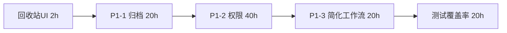
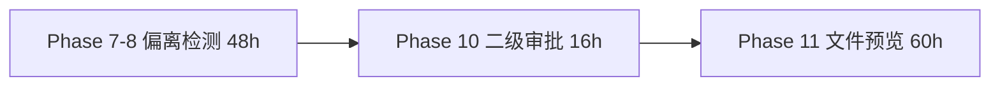
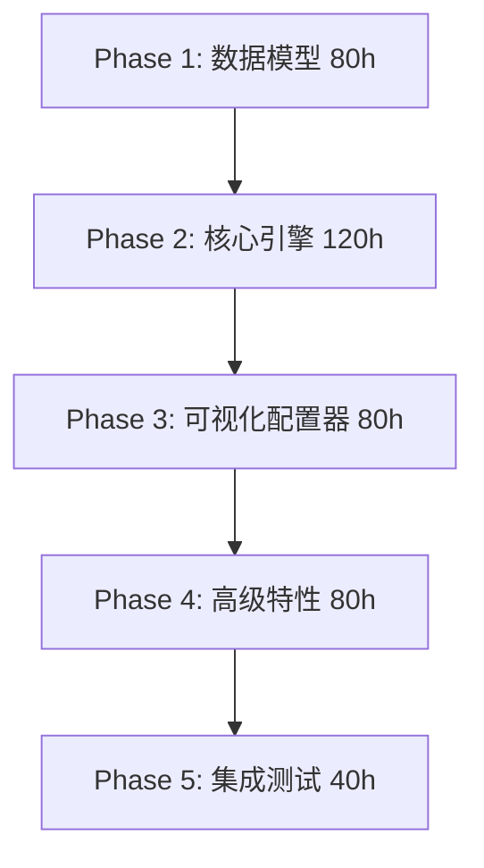

# 文档管理系统 - 完整开发 TodoList

> **文档版本**: 1.0
> **创建日期**: 2026-02-13
> **基于**: DESIGN.md v10.7
> **项目状态**: MVP 98.1% 完成，准备进入增量开发阶段

---

## 📊 总体进度概览

| 阶段 | 功能范围 | 完成度 | 待开发工时 | 优先级 | 状态 |
|------|---------|--------|-----------|--------|------|
| **MVP Phase 1-6** | 用户/文档/模板/任务/审批/通知 | 98.1% (51/52) | 2h | P0 | ⏳ 仅剩回收站UI |
| **P1 技术债务** | 归档/权限/工作流（简化） | 0% (0/3) | 80h | P1 | ⏳ 完整方案已就绪 |
| **Phase 7-8** | 配方偏离检测 | 60% | 48h | P2 | 🚧 核心检测已实现 |
| **Phase 9** | 数据导出 | 100% | 0h | - | ✅ Excel导出完成 |
| **Phase 10** | 二级审批流程 | 0% | 16h | P2 | ⏳ 依赖P1-3工作流 |
| **Phase 11** | 文件预览 | 30% | 60h | P2 | 🚧 PDF已完成 |
| **Phase 12** | 偏离统计分析 | 100% | 0h | - | ✅ ECharts图表完成 |
| **v2.0.0 工作流引擎** | 智能文档工作流系统 | 0% | 400h | P0 | ⏳ 替代P1-3 |
| **v2.0.0 扩展模块** | 培训/内审/仓库/设备/批次 | 0% | 1200h+ | P3 | ⏳ 长期规划 |
| **测试覆盖率提升** | 85.3% → 90%+ | 85.3% | 20h | P1 | ⏳ 单元+E2E |
| **总计** | | | **1826h+** | | |

**关键时间线**:
- **短期**（1-2 周）: 回收站UI + P1-1 文档归档 = 22h
- **中期**（4-8 周）: P1-2 权限系统 + P1-3 简化工作流 = 60h
- **长期**（6-12 个月）: v2.0.0 工作流引擎 + 扩展模块 = 1600h+

---

## 🎯 实施路线图

### **第一阶段：完成 MVP + P1 技术债务**（估时 102h，约 3 周）



**里程碑**: MVP 100% 完成 + P1 技术债务清零

### **第二阶段：完善现有功能**（估时 124h，约 4 周）



**里程碑**: Phase 1-12 全部完成

### **第三阶段：v2.0.0 智能工作流引擎**（估时 400h，约 10 周）



**里程碑**: 可配置工作流系统上线

### **第四阶段：扩展模块**（估时 1200h+，长期规划）

- 培训管理系统
- 内审管理系统
- 仓库管理系统
- 设备管理系统
- 批次追溯系统

---

## 📋 详细任务清单

---

## ✅ **已完成功能**（98.1% of MVP）

<details>
<summary>点击展开查看已完成的 51 个功能点</summary>

### Phase 1: 用户管理 ✅
- [x] 用户 CRUD（登录/注册/权限）- `server/src/modules/user/` + `client/src/views/user/`
- [x] 组织架构（树形结构）- `server/src/modules/department/` + `client/src/views/department/`

### Phase 2: 文档管理 ✅
- [x] 三级文档 CRUD - `server/src/modules/document/` + `client/src/views/document/`
- [x] 文件上传（MinIO S3）- `server/src/modules/file/`
- [x] 版本控制 - `Document.version` 字段
- [x] 文档预览（PDF）- `client/src/components/PdfViewer.vue`

### Phase 3: 审批流程 ✅
- [x] 单级审批 - `server/src/modules/approval/` + `client/src/views/approval/`
- [x] 审批记录 - `Approval` 表

### Phase 4: 模板管理 ✅
- [x] 四级模板 CRUD - `server/src/modules/template/` + `client/src/views/template/`
- [x] 字段类型支持（20+ 类型）- 文本/数字/日期/下拉等

### Phase 5: 任务管理 ✅
- [x] 任务派发 - `server/src/modules/task/` + `client/src/views/task/`
- [x] 任务填报（动态表单）- 基于模板字段

### Phase 6: 通知系统 ✅
- [x] 站内消息 - `server/src/modules/notification/` + `client/src/views/notification/`
- [x] 消息已读/未读 - `Notification.read` 字段

### Phase 7: 偏离检测 ✅
- [x] 公差配置 - `TemplateField.tolerance` 字段
- [x] 自动偏离检测 - 填报时自动检测
- [x] 偏离报告生成 - `DeviationReport` 表

### Phase 9: 数据导出 ✅
- [x] Excel 批量导出 - `server/src/modules/export/`
- [x] 动态列支持 - ExcelJS 生成

### Phase 12: 偏离统计 ✅
- [x] 偏离趋势分析 - `client/src/views/statistics/` + ECharts 图表
- [x] 字段分布统计 - 饼图展示
- [x] 部门偏离率 - 柱状图对比

### 其他功能 ✅
- [x] 回收站软删除 - `deleted_at` 字段（所有核心表支持）

</details>

---

## ⏳ **待实施功能**（按优先级排序）

---

### 🔴 **P0: MVP 完成（必须立即完成）**

#### Task-001: 回收站 UI 完善
**估时**: 2 小时
**优先级**: P0
**依赖**: 无
**状态**: ⏳ 待实施

##### 📝 需求描述
完成 MVP Phase 1-6 最后 1/52 的功能，实现回收站的前端界面，包括批量恢复、批量永久删除、空状态显示。

##### 📂 涉及文件
```
client/src/views/trash/Index.vue          # 回收站主页面
client/src/api/trash.ts                   # 回收站 API 调用
```

##### 🔧 开发步骤

**Step 1: 优化回收站页面布局**（30 分钟）
- [ ] 读取现有文件 `client/src/views/trash/Index.vue`
- [ ] 添加批量操作按钮组（页面顶部）
  ```vue
  <el-button type="primary" :disabled="!multipleSelection.length" @click="handleBatchRestore">
    批量恢复 ({{ multipleSelection.length }})
  </el-button>
  <el-button type="danger" :disabled="!multipleSelection.length" @click="handleBatchDelete">
    批量永久删除 ({{ multipleSelection.length }})
  </el-button>
  ```
- [ ] 优化表格列配置（删除时间、删除人、操作列）

**Step 2: 实现批量操作逻辑**（1 小时）
- [ ] 添加表格多选逻辑
  ```vue
  <el-table @selection-change="handleSelectionChange">
    <el-table-column type="selection" width="55" />
  </el-table>
  ```
- [ ] 实现批量恢复方法
  ```typescript
  const handleBatchRestore = async () => {
    await ElMessageBox.confirm('确认恢复选中的 X 项？', '批量恢复', {
      confirmButtonText: '确认',
      cancelButtonText: '取消',
      type: 'warning'
    })

    try {
      await batchRestoreItems(multipleSelection.value.map(item => item.id))
      ElMessage.success('批量恢复成功')
      fetchTrashList()
    } catch (error) {
      ElMessage.error(error.message || '批量恢复失败')
    }
  }
  ```
- [ ] 实现批量永久删除方法（类似逻辑 + 二次确认）

**Step 3: 添加空状态显示**（15 分钟）
- [ ] 添加 Empty 状态组件
  ```vue
  <el-empty v-if="!trashList.length && !loading" description="回收站为空">
    <el-button type="primary" @click="$router.push('/documents')">
      返回文档管理
    </el-button>
  </el-empty>
  ```

**Step 4: E2E 测试**（15 分钟）
- [ ] 测试批量恢复流程（选中 → 确认 → 刷新列表）
- [ ] 测试批量永久删除流程（选中 → 二次确认 → 刷新列表）
- [ ] 测试空状态显示

##### ✅ 验收标准
- ✅ 批量操作按钮显示正确（选中数量显示）
- ✅ 批量恢复功能正常（ElMessageBox 确认 + API 调用 + 列表刷新）
- ✅ 批量永久删除功能正常（二次确认）
- ✅ 空状态显示友好（无数据时显示 Empty 组件）
- ✅ 表格排序正确（按 deletedAt 倒序）
- ✅ E2E 测试通过

##### 🐛 常见问题排查
- **问题**: 批量操作按钮一直禁用
  **排查**: 检查 `multipleSelection` 是否正确绑定到 `@selection-change`
- **问题**: 永久删除后数据未刷新
  **排查**: 确认 API 返回成功后调用了 `fetchTrashList()`

---

### 🟠 **P1: 技术债务修复（高优先级）**

---

#### Task-002: P1-1 文档归档/作废功能
**估时**: 20 小时
**优先级**: P1
**依赖**: Task-001 完成
**状态**: ⏳ 待实施
**完整方案**: DESIGN.md v10.7 第 22.2.1 章

##### 📝 需求描述
实现 BRCGS 合规所需的文档归档（Archive）和作废（Obsolete）功能，包括：
- 文档归档：将"已发布"文档标记为归档状态，保留查看权限但不可编辑
- 文档作废：文档被新版本替代时标记为作废，必须填写替代文档
- 文档恢复：管理员可将归档/作废文档恢复为"已发布"状态

**业务规则**:
- BR-346: 文档归档规则
- BR-347: 文档作废规则
- BR-348: 文档恢复规则

##### 📂 涉及文件
```
# 后端
server/src/prisma/schema.prisma                              # Prisma Schema 更新
server/src/modules/documents/dto/archive-document.dto.ts    # 归档 DTO
server/src/modules/documents/dto/obsolete-document.dto.ts   # 作废 DTO
server/src/modules/documents/dto/restore-document.dto.ts    # 恢复 DTO
server/src/modules/documents/documents.service.ts           # 服务层实现
server/src/modules/documents/documents.controller.ts        # 控制器
server/test/documents-archive.e2e-spec.ts                   # E2E 测试

# 前端
client/src/views/documents/Detail.vue                       # 文档详情页（添加按钮）
client/src/components/documents/ArchiveDialog.vue           # 归档对话框
client/src/components/documents/ObsoleteDialog.vue          # 作废对话框
client/src/api/documents.ts                                 # API 调用
```

##### 🔧 开发步骤

**Phase 1: 数据库迁移**（30 分钟）

<details>
<summary>点击展开详细步骤</summary>

- [ ] **Step 1.1**: 更新 Prisma Schema
  ```bash
  # 打开文件
  code server/src/prisma/schema.prisma
  ```

  在 `Document` model 中添加 6 个新字段：
  ```prisma
  model Document {
    // ... 现有字段
    archivedAt      DateTime?
    archivedBy      String?
    archivedReason  String?
    obsoletedAt     DateTime?
    obsoletedBy     String?
    obsoletedReason String?
    replacedByDocId String?
  }
  ```

- [ ] **Step 1.2**: 运行数据库迁移
  ```bash
  cd server
  npx prisma migrate dev --name add-document-archive-fields
  ```

- [ ] **Step 1.3**: 验证迁移成功
  ```bash
  npx prisma studio
  # 打开 Document 表，确认 6 个新字段存在
  ```

- [ ] **Step 1.4**: 测试
  - 验证迁移文件生成（`server/prisma/migrations/YYYYMMDDHHMMSS_add-document-archive-fields/migration.sql`）
  - 验证数据库表结构已更新

- [ ] **Step 1.5**: 常见问题排查
  - 如果迁移失败："Prisma migrate 报错" → 运行 `npx prisma db push --force-reset`（测试环境）
  - 如果字段未显示："Prisma Studio 看不到新字段" → 运行 `npx prisma generate`

</details>

**Phase 2: 后端 DTO 定义**（15 分钟）

<details>
<summary>点击展开详细步骤</summary>

- [ ] **Step 2.1**: 创建归档 DTO
  ```bash
  code server/src/modules/documents/dto/archive-document.dto.ts
  ```

  ```typescript
  import { IsString, IsNotEmpty } from 'class-validator';
  import { ApiProperty } from '@nestjs/swagger';

  export class ArchiveDocumentDto {
    @ApiProperty({ description: '归档原因', example: '该文档已过时，新版本为 DOC-2026-002' })
    @IsString()
    @IsNotEmpty()
    reason: string;
  }
  ```

- [ ] **Step 2.2**: 创建作废 DTO
  ```typescript
  export class ObsoleteDocumentDto {
    @ApiProperty({ description: '作废原因' })
    @IsString()
    @IsNotEmpty()
    reason: string;

    @ApiProperty({ description: '替代文档 ID', required: false })
    @IsString()
    @IsOptional()
    replacedByDocId?: string;
  }
  ```

- [ ] **Step 2.3**: 创建恢复 DTO
  ```typescript
  export class RestoreDocumentDto {
    @ApiProperty({ description: '恢复原因' })
    @IsString()
    @IsNotEmpty()
    reason: string;
  }
  ```

</details>

**Phase 3: 后端服务层实现**（2 小时）

<details>
<summary>点击展开详细步骤</summary>

- [ ] **Step 3.1**: 在 `DocumentsService` 添加归档方法
  ```typescript
  async archiveDocument(id: string, userId: string, dto: ArchiveDocumentDto) {
    // BR-346: 只有"已发布"状态文档可归档
    const doc = await this.prisma.document.findUnique({ where: { id } });
    if (!doc) throw new NotFoundException('文档不存在');
    if (doc.status !== 'published') {
      throw new BadRequestException('只有"已发布"状态文档可归档');
    }

    // 更新文档状态
    return this.prisma.document.update({
      where: { id },
      data: {
        archivedAt: new Date(),
        archivedBy: userId,
        archivedReason: dto.reason,
      },
    });
  }
  ```

- [ ] **Step 3.2**: 添加作废方法（类似逻辑 + BR-347 规则）
- [ ] **Step 3.3**: 添加恢复方法（需管理员权限 + BR-348 规则）

</details>

**Phase 4: 后端控制器**（30 分钟）

<details>
<summary>点击展开详细步骤</summary>

- [ ] **Step 4.1**: 在 `DocumentsController` 添加 3 个端点
  ```typescript
  @Post(':id/archive')
  @ApiBearerAuth()
  @ApiOperation({ summary: '归档文档' })
  async archive(
    @Param('id') id: string,
    @Req() req,
    @Body() dto: ArchiveDocumentDto
  ) {
    return this.documentsService.archiveDocument(id, req.user.id, dto);
  }

  @Post(':id/obsolete')
  async obsolete(@Param('id') id: string, @Req() req, @Body() dto: ObsoleteDocumentDto) {
    return this.documentsService.obsoleteDocument(id, req.user.id, dto);
  }

  @Post(':id/restore')
  @UseGuards(AdminGuard)  // 仅管理员可恢复
  async restore(@Param('id') id: string, @Req() req, @Body() dto: RestoreDocumentDto) {
    return this.documentsService.restoreDocument(id, req.user.id, dto);
  }
  ```

- [ ] **Step 4.2**: 添加 Swagger 文档注解

</details>

**Phase 5: 后端单元测试**（1.5 小时）

<details>
<summary>点击展开详细步骤</summary>

- [ ] **Step 5.1**: 创建测试文件 `server/test/documents-archive.e2e-spec.ts`
- [ ] **Step 5.2**: 测试归档流程
  ```typescript
  it('should archive a published document', async () => {
    const doc = await createTestDocument({ status: 'published' });

    const response = await request(app.getHttpServer())
      .post(`/documents/${doc.id}/archive`)
      .set('Authorization', `Bearer ${adminToken}`)
      .send({ reason: '文档已过时' })
      .expect(200);

    expect(response.body.archivedAt).toBeDefined();
    expect(response.body.archivedReason).toBe('文档已过时');
  });

  it('should fail to archive a draft document', async () => {
    const doc = await createTestDocument({ status: 'draft' });

    await request(app.getHttpServer())
      .post(`/documents/${doc.id}/archive`)
      .set('Authorization', `Bearer ${adminToken}`)
      .send({ reason: '文档已过时' })
      .expect(400);  // BadRequestException
  });
  ```

- [ ] **Step 5.3**: 测试作废流程（需填写替代文档）
- [ ] **Step 5.4**: 测试恢复流程（管理员权限）
- [ ] **Step 5.5**: 运行测试 `npm test -- documents-archive.e2e-spec.ts`
- [ ] **Step 5.6**: 验证覆盖率 > 80%

</details>

**Phase 6: 前端归档/作废对话框**（2 小时）

<details>
<summary>点击展开详细步骤</summary>

- [ ] **Step 6.1**: 创建归档对话框组件
  ```bash
  code client/src/components/documents/ArchiveDialog.vue
  ```

  ```vue
  <template>
    <el-dialog v-model="visible" title="归档文档" width="500px">
      <el-form :model="form" :rules="rules" ref="formRef">
        <el-form-item label="归档原因" prop="reason">
          <el-input
            v-model="form.reason"
            type="textarea"
            :rows="4"
            placeholder="请输入归档原因（必填）"
          />
        </el-form-item>
      </el-form>
      <template #footer>
        <el-button @click="visible = false">取消</el-button>
        <el-button type="primary" @click="handleConfirm" :loading="loading">
          确认归档
        </el-button>
      </template>
    </el-dialog>
  </template>

  <script setup lang="ts">
  import { ref, reactive } from 'vue'
  import { ElMessage } from 'element-plus'
  import { archiveDocument } from '@/api/documents'

  const visible = ref(false)
  const loading = ref(false)
  const form = reactive({ reason: '' })
  const rules = {
    reason: [{ required: true, message: '请输入归档原因', trigger: 'blur' }]
  }

  const handleConfirm = async () => {
    try {
      loading.value = true
      await archiveDocument(props.documentId, form)
      ElMessage.success('文档已归档')
      visible.value = false
      emit('success')
    } catch (error) {
      ElMessage.error(error.message || '归档失败')
    } finally {
      loading.value = false
    }
  }
  </script>
  ```

- [ ] **Step 6.2**: 创建作废对话框组件（类似逻辑 + 替代文档选择器）

</details>

**Phase 7: 前端文档详情页集成**（1 小时）

<details>
<summary>点击展开详细步骤</summary>

- [ ] **Step 7.1**: 在文档详情页添加归档/作废按钮
  ```vue
  <!-- client/src/views/documents/Detail.vue -->
  <template>
    <div class="document-detail">
      <!-- 现有内容 -->

      <div class="action-buttons" v-if="document.status === 'published'">
        <el-button @click="showArchiveDialog = true">归档</el-button>
        <el-button @click="showObsoleteDialog = true">作废</el-button>
      </div>

      <ArchiveDialog
        v-model="showArchiveDialog"
        :document-id="document.id"
        @success="fetchDocumentDetail"
      />
      <ObsoleteDialog
        v-model="showObsoleteDialog"
        :document-id="document.id"
        @success="fetchDocumentDetail"
      />
    </div>
  </template>
  ```

- [ ] **Step 7.2**: 添加 API 调用方法
  ```typescript
  // client/src/api/documents.ts
  export const archiveDocument = (id: string, data: { reason: string }) =>
    request.post(`/documents/${id}/archive`, data)

  export const obsoleteDocument = (id: string, data: { reason: string, replacedByDocId?: string }) =>
    request.post(`/documents/${id}/obsolete`, data)

  export const restoreDocument = (id: string, data: { reason: string }) =>
    request.post(`/documents/${id}/restore`, data)
  ```

</details>

**Phase 8: E2E 测试**（30 分钟）

<details>
<summary>点击展开详细步骤</summary>

- [ ] **Step 8.1**: 测试归档流程
  - 打开文档详情页（状态为"已发布"）
  - 点击"归档"按钮
  - 填写归档原因
  - 确认归档
  - 验证文档详情页刷新，状态变为"已归档"
  - 验证归档后文档不可编辑

- [ ] **Step 8.2**: 测试作废流程（类似）
- [ ] **Step 8.3**: 测试恢复流程（管理员登录）

</details>

##### ✅ 验收标准
- ✅ 数据库迁移成功，6 个新字段已添加
- ✅ 3 个 API 端点正常工作（`/archive`, `/obsolete`, `/restore`）
- ✅ 后端单元测试覆盖率 > 80%
- ✅ 前端归档/作废按钮显示正确（仅"已发布"状态显示）
- ✅ 归档对话框交互流畅（表单验证、成功提示）
- ✅ E2E 测试通过（完整归档流程）
- ✅ 遵循 BR-346, BR-347, BR-348 业务规则

##### 🐛 常见问题排查
- **问题**: Prisma 迁移失败 → 参考 CLAUDE.md #3 "编码后立即验证原则"
- **问题**: API 返回 403 权限不足 → 检查 JWT Token 是否正确、用户角色是否为管理员
- **问题**: 前端对话框不显示 → 检查 `v-model` 绑定是否正确

---

#### Task-003: P1-2 细粒度权限系统
**估时**: 40 小时
**优先级**: P1
**依赖**: Task-002 完成
**状态**: ⏳ 待实施
**完整方案**: DESIGN.md v10.7 第 22.2.2 章

##### 📝 需求描述
实现基于 RBAC + 资源级的细粒度权限系统，支持：
- 权限定义（20-30 个预定义权限，按功能分类）
- 权限授予（可指定过期时间、资源范围）
- 权限撤销（需填写原因）
- 权限检查（API 中间件 + 前端按钮控制）
- 权限过期自动失效

**业务规则**:
- BR-349: 权限定义规则
- BR-350: 权限授予规则
- BR-351: 权限撤销规则
- BR-352: 资源级权限规则
- BR-353: 权限过期规则

##### 📂 涉及文件
```
# 后端
server/src/prisma/schema.prisma                              # Prisma Schema（Permission + UserPermission 表）
server/src/modules/permissions/permissions.module.ts         # 权限模块
server/src/modules/permissions/permissions.service.ts        # 权限服务
server/src/modules/permissions/permissions.controller.ts     # 权限控制器
server/src/modules/permissions/permissions.seed.ts           # 权限种子数据
server/src/modules/permissions/guards/permission.guard.ts    # 权限守卫
server/src/modules/permissions/dto/grant-permission.dto.ts   # 授予权限 DTO
server/test/permissions.e2e-spec.ts                          # E2E 测试

# 前端
client/src/views/system/UserPermissions.vue                  # 用户权限管理页
client/src/components/permissions/GrantDialog.vue            # 授予权限对话框
client/src/api/permissions.ts                                # API 调用
client/src/composables/usePermission.ts                      # 权限检查 Hook
```

##### 🔧 开发步骤

**Phase 1: 权限定义**（2 小时）

<details>
<summary>点击展开详细步骤</summary>

- [ ] **Step 1.1**: 定义权限清单
  ```typescript
  // server/src/modules/permissions/permissions.seed.ts
  export const PERMISSIONS = [
    // 文档类权限
    { code: 'document:cross_dept_view', name: '跨部门文档查看', category: 'document', scope: 'company' },
    { code: 'document:delete', name: '文档删除', category: 'document', scope: 'department' },
    { code: 'document:export', name: '文档导出', category: 'document', scope: 'department' },

    // 模板类权限
    { code: 'template:edit', name: '模板编辑', category: 'template', scope: 'company' },
    { code: 'template:delete', name: '模板删除', category: 'template', scope: 'company' },

    // 任务类权限
    { code: 'task:assign', name: '任务分配', category: 'task', scope: 'department' },
    { code: 'task:approve', name: '任务审批', category: 'task', scope: 'resource' },

    // 审批类权限
    { code: 'approval:override', name: '审批覆盖', category: 'approval', scope: 'company' },

    // 系统类权限
    { code: 'system:user_manage', name: '用户管理', category: 'system', scope: 'company' },
    { code: 'system:permission_grant', name: '权限授予', category: 'system', scope: 'company' },

    // ... 更多权限（总计 20-30 个）
  ];
  ```

- [ ] **Step 1.2**: 权限分类汇总
  - 文档类（document）: 5-8 个权限
  - 模板类（template）: 3-5 个权限
  - 任务类（task）: 3-5 个权限
  - 审批类（approval）: 2-3 个权限
  - 系统类（system）: 5-8 个权限

</details>

**Phase 2: 数据库设计**（1.5 小时）

<details>
<summary>点击展开详细步骤</summary>

- [ ] **Step 2.1**: 更新 Prisma Schema
  ```prisma
  model Permission {
    id          String   @id @default(cuid())
    code        String   @unique          // 如 "document:cross_dept_view"
    name        String                     // 如 "跨部门文档查看"
    category    String                     // 如 "document"
    scope       String   @default("department")  // "department" | "company" | "resource"
    description String?
    createdAt   DateTime @default(now())
    updatedAt   DateTime @updatedAt
    users       UserPermission[]
    @@map("permissions")
  }

  model UserPermission {
    id            String   @id @default(cuid())
    userId        String
    permissionId  String
    grantedBy     String   // 授予人用户 ID
    grantedByName String   // 授予人姓名（冗余字段，便于审计）
    grantedAt     DateTime @default(now())
    expiresAt     DateTime?  // 可选，权限过期时间
    reason        String?    // 授予原因
    resourceType  String?    // 如 "template"、"document"
    resourceId    String?    // 如模板 ID、文档 ID
    user          User       @relation(fields: [userId], references: [id], onDelete: Cascade)
    permission    Permission @relation(fields: [permissionId], references: [id], onDelete: Cascade)
    @@index([userId])
    @@index([permissionId])
    @@index([expiresAt])
    @@map("user_permissions")
  }
  ```

- [ ] **Step 2.2**: 运行数据库迁移
  ```bash
  npx prisma migrate dev --name add-permission-tables
  ```

- [ ] **Step 2.3**: 创建权限种子数据
  ```bash
  npx prisma db seed
  ```

</details>

**Phase 3: 后端服务层**（6 小时）

<details>
<summary>点击展开详细步骤</summary>

- [ ] **Step 3.1**: 创建权限服务
  ```typescript
  @Injectable()
  export class PermissionsService {
    // 获取所有权限定义
    async getAllPermissions() {
      return this.prisma.permission.findMany();
    }

    // 获取用户权限列表
    async getUserPermissions(userId: string) {
      return this.prisma.userPermission.findMany({
        where: { userId },
        include: { permission: true },
      });
    }

    // 授予权限
    async grantPermission(dto: GrantPermissionDto, grantedBy: string) {
      // BR-350: 授予权限规则
      return this.prisma.userPermission.create({
        data: {
          userId: dto.userId,
          permissionId: dto.permissionId,
          grantedBy,
          grantedByName: await this.getUserName(grantedBy),
          expiresAt: dto.expiresAt,
          reason: dto.reason,
          resourceType: dto.resourceType,
          resourceId: dto.resourceId,
        },
      });
    }

    // 撤销权限
    async revokePermission(id: string, reason: string) {
      // BR-351: 撤销权限规则
      return this.prisma.userPermission.delete({ where: { id } });
    }

    // 检查用户权限
    async checkPermission(userId: string, permissionCode: string, resourceId?: string): Promise<boolean> {
      const now = new Date();

      const permission = await this.prisma.permission.findUnique({
        where: { code: permissionCode },
      });
      if (!permission) return false;

      const userPermission = await this.prisma.userPermission.findFirst({
        where: {
          userId,
          permissionId: permission.id,
          OR: [
            { expiresAt: null },  // 永久权限
            { expiresAt: { gte: now } },  // 未过期
          ],
          ...(resourceId && {
            OR: [
              { resourceId: null },  // 全局权限
              { resourceId },  // 资源级权限
            ],
          }),
        },
      });

      return !!userPermission;
    }

    // 批量授予权限
    async batchGrantPermissions(userIds: string[], permissionId: string, grantedBy: string) {
      const data = userIds.map(userId => ({
        userId,
        permissionId,
        grantedBy,
        grantedByName: this.getUserName(grantedBy),
      }));

      return this.prisma.userPermission.createMany({ data });
    }
  }
  ```

- [ ] **Step 3.2**: 创建权限守卫
  ```typescript
  @Injectable()
  export class PermissionGuard implements CanActivate {
    constructor(private permissionsService: PermissionsService) {}

    async canActivate(context: ExecutionContext): Promise<boolean> {
      const request = context.switchToHttp().getRequest();
      const user = request.user;
      const requiredPermission = this.reflector.get<string>('permission', context.getHandler());

      if (!requiredPermission) return true;  // 无权限要求

      return this.permissionsService.checkPermission(user.id, requiredPermission);
    }
  }
  ```

</details>

**Phase 4: 后端 API 端点**（2 小时）

<details>
<summary>点击展开详细步骤</summary>

- [ ] **Step 4.1**: 创建权限控制器
  ```typescript
  @Controller('permissions')
  @ApiBearerAuth()
  export class PermissionsController {
    @Get()
    @ApiOperation({ summary: '获取所有权限定义' })
    async getAllPermissions() {
      return this.permissionsService.getAllPermissions();
    }

    @Get('user/:userId')
    @ApiOperation({ summary: '获取用户权限列表' })
    async getUserPermissions(@Param('userId') userId: string) {
      return this.permissionsService.getUserPermissions(userId);
    }

    @Post('grant')
    @UseGuards(PermissionGuard)
    @RequirePermission('system:permission_grant')
    @ApiOperation({ summary: '授予权限' })
    async grantPermission(@Body() dto: GrantPermissionDto, @Req() req) {
      return this.permissionsService.grantPermission(dto, req.user.id);
    }

    @Delete(':id')
    @UseGuards(PermissionGuard)
    @RequirePermission('system:permission_grant')
    @ApiOperation({ summary: '撤销权限' })
    async revokePermission(@Param('id') id: string, @Body() body: { reason: string }) {
      return this.permissionsService.revokePermission(id, body.reason);
    }

    @Get('check')
    @ApiOperation({ summary: '检查用户权限' })
    async checkPermission(
      @Query('userId') userId: string,
      @Query('permissionCode') permissionCode: string,
      @Query('resourceId') resourceId?: string,
    ) {
      const hasPermission = await this.permissionsService.checkPermission(
        userId,
        permissionCode,
        resourceId,
      );
      return { hasPermission };
    }

    @Post('batch-grant')
    @UseGuards(PermissionGuard)
    @RequirePermission('system:permission_grant')
    @ApiOperation({ summary: '批量授予权限' })
    async batchGrant(@Body() dto: BatchGrantDto, @Req() req) {
      return this.permissionsService.batchGrantPermissions(
        dto.userIds,
        dto.permissionId,
        req.user.id,
      );
    }
  }
  ```

</details>

**Phase 5: 后端单元测试**（4 小时）

<details>
<summary>点击展开详细步骤</summary>

- [ ] **Step 5.1**: 创建测试文件 `server/test/permissions.e2e-spec.ts`
- [ ] **Step 5.2**: 测试权限授予流程
  ```typescript
  it('should grant permission to user', async () => {
    const response = await request(app.getHttpServer())
      .post('/permissions/grant')
      .set('Authorization', `Bearer ${adminToken}`)
      .send({
        userId: testUser.id,
        permissionId: testPermission.id,
        reason: '财务审计需要',
        expiresAt: '2026-03-01T00:00:00Z',
      })
      .expect(201);

    expect(response.body.userId).toBe(testUser.id);
    expect(response.body.permissionId).toBe(testPermission.id);
  });
  ```

- [ ] **Step 5.3**: 测试权限撤销流程
- [ ] **Step 5.4**: 测试权限检查（含过期、资源级）
- [ ] **Step 5.5**: 测试批量授予
- [ ] **Step 5.6**: 验证覆盖率 > 80%

</details>

**Phase 6: 前端权限管理页面**（8 小时）

<details>
<summary>点击展开详细步骤</summary>

- [ ] **Step 6.1**: 创建用户权限管理页面
  ```vue
  <!-- client/src/views/system/UserPermissions.vue -->
  <template>
    <div class="user-permissions">
      <el-page-header @back="$router.back()" title="返回" content="用户权限管理" />

      <el-card>
        <template #header>
          <div class="card-header">
            <span>用户: {{ user.name }} ({{ user.department.name }})</span>
            <el-button type="primary" @click="grantDialogVisible = true">
              授予权限
            </el-button>
          </div>
        </template>

        <el-table :data="userPermissions" style="width: 100%">
          <el-table-column prop="permission.name" label="权限名称" />
          <el-table-column prop="permission.category" label="类别" />
          <el-table-column prop="grantedByName" label="授予人" />
          <el-table-column prop="grantedAt" label="授予时间">
            <template #default="{ row }">
              {{ formatDate(row.grantedAt) }}
            </template>
          </el-table-column>
          <el-table-column prop="expiresAt" label="过期时间">
            <template #default="{ row }">
              {{ row.expiresAt ? formatDate(row.expiresAt) : '永久' }}
            </template>
          </el-table-column>
          <el-table-column label="操作" width="100">
            <template #default="{ row }">
              <el-button link type="danger" @click="handleRevoke(row)">
                撤销
              </el-button>
            </template>
          </el-table-column>
        </el-table>
      </el-card>

      <!-- 授予权限对话框 -->
      <GrantDialog
        v-model="grantDialogVisible"
        :user-id="userId"
        @success="fetchUserPermissions"
      />
    </div>
  </template>

  <script setup lang="ts">
  import { ref, onMounted } from 'vue'
  import { useRoute } from 'vue-router'
  import { ElMessage, ElMessageBox } from 'element-plus'
  import { getUserPermissions, revokePermission } from '@/api/permissions'
  import GrantDialog from '@/components/permissions/GrantDialog.vue'

  const route = useRoute()
  const userId = route.params.id
  const userPermissions = ref([])
  const grantDialogVisible = ref(false)

  const fetchUserPermissions = async () => {
    const res = await getUserPermissions(userId)
    userPermissions.value = res.data
  }

  const handleRevoke = async (row) => {
    try {
      await ElMessageBox.confirm('确认撤销该权限?', '警告', { type: 'warning' })
      const { value: reason } = await ElMessageBox.prompt('请输入撤销原因', '撤销权限')

      await revokePermission(row.id, { reason })
      ElMessage.success('权限已撤销')
      fetchUserPermissions()
    } catch (error) {
      if (error !== 'cancel') {
        ElMessage.error(error.message || '撤销失败')
      }
    }
  }

  onMounted(() => {
    fetchUserPermissions()
  })
  </script>
  ```

- [ ] **Step 6.2**: 创建授予权限对话框（参考 DESIGN.md v10.7 第 22.2.2 章 Vue 3 代码示例）

</details>

**Phase 7: 前端权限检查 Hook**（2 小时）

<details>
<summary>点击展开详细步骤</summary>

- [ ] **Step 7.1**: 创建 `usePermission` composable
  ```typescript
  // client/src/composables/usePermission.ts
  import { computed } from 'vue'
  import { useUserStore } from '@/stores/user'

  export function usePermission() {
    const userStore = useUserStore()

    const hasPermission = (permissionCode: string): boolean => {
      return userStore.permissions.some(p => p.code === permissionCode)
    }

    const hasAnyPermission = (...permissionCodes: string[]): boolean => {
      return permissionCodes.some(code => hasPermission(code))
    }

    const hasAllPermissions = (...permissionCodes: string[]): boolean => {
      return permissionCodes.every(code => hasPermission(code))
    }

    return {
      hasPermission,
      hasAnyPermission,
      hasAllPermissions,
    }
  }
  ```

- [ ] **Step 7.2**: 在按钮中使用权限检查
  ```vue
  <el-button
    v-if="hasPermission('document:delete')"
    type="danger"
    @click="handleDelete"
  >
    删除
  </el-button>
  ```

</details>

**Phase 8: E2E 测试**（2 小时）

<details>
<summary>点击展开详细步骤</summary>

- [ ] **Step 8.1**: 测试授予权限流程
- [ ] **Step 8.2**: 测试撤销权限流程
- [ ] **Step 8.3**: 测试权限过期后无法访问

</details>

##### ✅ 验收标准
- ✅ Permission 和 UserPermission 表已创建，索引正确
- ✅ 20-30 个默认权限已插入
- ✅ 6 个 API 端点正常工作
- ✅ 权限守卫正确拦截无权限请求（返回 403）
- ✅ 后端单元测试覆盖率 > 80%
- ✅ 前端权限管理页面显示正常
- ✅ 授予/撤销权限流程流畅
- ✅ E2E 测试通过
- ✅ 遵循 BR-349 ~ BR-353 业务规则

##### 🐛 常见问题排查
- **问题**: 权限守卫不生效 → 检查 `@UseGuards(PermissionGuard)` 是否正确添加
- **问题**: 权限检查总是返回 false → 检查 `UserPermission.expiresAt` 是否过期
- **问题**: 前端按钮权限控制不生效 → 检查 `usePermission` Hook 是否正确导入

---

#### Task-004: P1-3 简化工作流引擎
**估时**: 20 小时
**优先级**: P1
**依赖**: Task-003 完成（依赖权限系统）
**状态**: ⏳ 待实施
**完整方案**: DESIGN.md v10.7 第 22.2.3 章
**备注**: 这是 v2.0.0 工作流引擎的简化版，仅实现基础串行审批

##### 📝 需求描述
实现基础工作流引擎，支持：
- 工作流模板定义（JSON 配置串行审批步骤）
- 工作流启动（指定模板 + 关联业务对象）
- 串行审批流程（主管 → 经理 → 总监）
- 审批通过/驳回
- 工作流取消

**不包含**（留给 v2.0.0）:
- 并行审批
- 条件分支
- 子工作流
- 审批超时升级
- 可视化配置器

**业务规则**:
- BR-354: 工作流模板规则
- BR-355: 工作流启动规则
- BR-356: 串行审批规则
- BR-359: 工作流取消规则

##### 📂 涉及文件
```
# 后端
server/src/prisma/schema.prisma                              # Prisma Schema（3 个工作流表）
server/src/modules/workflow/workflow.module.ts               # 工作流模块
server/src/modules/workflow/workflow.service.ts              # 工作流服务
server/src/modules/workflow/workflow.controller.ts           # 工作流控制器
server/src/modules/workflow/dto/create-template.dto.ts       # 创建模板 DTO
server/src/modules/workflow/dto/start-workflow.dto.ts        # 启动工作流 DTO
server/test/workflow.e2e-spec.ts                             # E2E 测试

# 前端
client/src/views/workflow/MyTasks.vue                        # 我的待审批任务
client/src/components/workflow/ApprovalDialog.vue           # 审批对话框
client/src/api/workflow.ts                                   # API 调用
```

##### 🔧 开发步骤

**Phase 1: 数据库设计**（1 小时）

<details>
<summary>点击展开详细步骤</summary>

- [ ] **Step 1.1**: 更新 Prisma Schema
  ```prisma
  model WorkflowTemplate {
    id          String   @id @default(cuid())
    name        String   // 如 "文档审批流程（三级）"
    description String?
    category    String   // "document" | "task" | "deviation"
    steps       Json     // 步骤定义数组
    isActive    Boolean  @default(true)
    createdBy   String
    createdAt   DateTime @default(now())
    updatedAt   DateTime @updatedAt
    instances   WorkflowInstance[]
    @@map("workflow_templates")
  }

  model WorkflowInstance {
    id          String   @id @default(cuid())
    templateId  String
    name        String   // 如 "文档《质量手册v2》审批流程"
    status      String   // "pending" | "in_progress" | "completed" | "rejected" | "cancelled"
    businessType String  // "document" | "task" | "deviation"
    businessId  String   // 关联业务对象 ID
    currentStep Int      @default(0)
    startedBy   String
    startedAt   DateTime @default(now())
    completedAt DateTime?
    template    WorkflowTemplate @relation(fields: [templateId], references: [id])
    tasks       WorkflowTask[]
    @@index([businessType, businessId])
    @@map("workflow_instances")
  }

  model WorkflowTask {
    id          String   @id @default(cuid())
    instanceId  String
    stepIndex   Int      // 步骤序号（从 0 开始）
    stepName    String   // 如 "主管审批"
    assignee    String   // 审批人用户 ID
    assigneeName String  // 审批人姓名（冗余字段）
    status      String   // "pending" | "approved" | "rejected" | "cancelled"
    comment     String?  // 审批意见
    dueAt       DateTime? // 截止时间
    completedAt DateTime?
    instance    WorkflowInstance @relation(fields: [instanceId], references: [id], onDelete: Cascade)
    @@index([assignee, status])
    @@map("workflow_tasks")
  }
  ```

- [ ] **Step 1.2**: 运行数据库迁移
  ```bash
  npx prisma migrate dev --name add-workflow-tables
  ```

</details>

**Phase 2: 后端工作流引擎**（6 小时）

<details>
<summary>点击展开详细步骤</summary>

- [ ] **Step 2.1**: 创建工作流服务
  ```typescript
  @Injectable()
  export class WorkflowService {
    // 创建工作流模板
    async createTemplate(dto: CreateTemplateDto) {
      return this.prisma.workflowTemplate.create({
        data: {
          name: dto.name,
          category: dto.category,
          steps: dto.steps,
          createdBy: dto.createdBy,
        },
      });
    }

    // 启动工作流
    async startWorkflow(dto: StartWorkflowDto, startedBy: string) {
      const template = await this.prisma.workflowTemplate.findUnique({
        where: { id: dto.templateId },
      });
      if (!template) throw new NotFoundException('工作流模板不存在');

      // 创建工作流实例
      const instance = await this.prisma.workflowInstance.create({
        data: {
          templateId: dto.templateId,
          name: dto.name,
          businessType: dto.businessType,
          businessId: dto.businessId,
          startedBy,
          status: 'in_progress',
        },
      });

      // 创建第一步审批任务
      const firstStep = template.steps[0];
      await this.createTask(instance.id, 0, firstStep);

      return instance;
    }

    // 审批通过
    async approveTask(taskId: string, userId: string, comment: string) {
      const task = await this.prisma.workflowTask.findUnique({
        where: { id: taskId },
        include: { instance: { include: { template: true } } },
      });
      if (!task) throw new NotFoundException('审批任务不存在');
      if (task.assignee !== userId) throw new ForbiddenException('无权限审批此任务');

      // 更新任务状态
      await this.prisma.workflowTask.update({
        where: { id: taskId },
        data: {
          status: 'approved',
          comment,
          completedAt: new Date(),
        },
      });

      // 检查是否有下一步
      const template = task.instance.template;
      const nextStepIndex = task.stepIndex + 1;

      if (nextStepIndex < template.steps.length) {
        // 创建下一步任务
        const nextStep = template.steps[nextStepIndex];
        await this.createTask(task.instanceId, nextStepIndex, nextStep);
        await this.prisma.workflowInstance.update({
          where: { id: task.instanceId },
          data: { currentStep: nextStepIndex },
        });
      } else {
        // 工作流完成
        await this.prisma.workflowInstance.update({
          where: { id: task.instanceId },
          data: {
            status: 'completed',
            completedAt: new Date(),
          },
        });
      }
    }

    // 审批驳回
    async rejectTask(taskId: string, userId: string, comment: string) {
      const task = await this.prisma.workflowTask.findUnique({ where: { id: taskId } });
      if (!task) throw new NotFoundException('审批任务不存在');
      if (task.assignee !== userId) throw new ForbiddenException('无权限审批此任务');

      // 更新任务状态
      await this.prisma.workflowTask.update({
        where: { id: taskId },
        data: {
          status: 'rejected',
          comment,
          completedAt: new Date(),
        },
      });

      // 工作流驳回
      await this.prisma.workflowInstance.update({
        where: { id: task.instanceId },
        data: {
          status: 'rejected',
          completedAt: new Date(),
        },
      });
    }

    // 获取我的待审批任务
    async getMyTasks(userId: string, status?: string) {
      return this.prisma.workflowTask.findMany({
        where: {
          assignee: userId,
          ...(status && { status }),
        },
        include: { instance: true },
        orderBy: { createdAt: 'desc' },
      });
    }

    private async createTask(instanceId: string, stepIndex: number, step: any) {
      const assignee = await this.resolveAssignee(step.assigneeRole);

      return this.prisma.workflowTask.create({
        data: {
          instanceId,
          stepIndex,
          stepName: step.name,
          assignee: assignee.id,
          assigneeName: assignee.name,
          status: 'pending',
        },
      });
    }

    private async resolveAssignee(role: string) {
      // 简化版：根据角色查找用户
      // 实际应根据部门、角色等复杂逻辑查找
      return this.prisma.user.findFirst({ where: { role } });
    }
  }
  ```

</details>

**Phase 3: 后端 API 端点**（2 小时）

<details>
<summary>点击展开详细步骤</summary>

- [ ] **Step 3.1**: 创建工作流控制器
  ```typescript
  @Controller('workflow')
  @ApiBearerAuth()
  export class WorkflowController {
    @Post('templates')
    @UseGuards(AdminGuard)
    @ApiOperation({ summary: '创建工作流模板' })
    async createTemplate(@Body() dto: CreateTemplateDto, @Req() req) {
      return this.workflowService.createTemplate({ ...dto, createdBy: req.user.id });
    }

    @Get('templates')
    @ApiOperation({ summary: '获取工作流模板列表' })
    async getTemplates(@Query('category') category?: string) {
      return this.workflowService.getTemplates(category);
    }

    @Post('instances')
    @ApiOperation({ summary: '启动工作流' })
    async startWorkflow(@Body() dto: StartWorkflowDto, @Req() req) {
      return this.workflowService.startWorkflow(dto, req.user.id);
    }

    @Get('my-tasks')
    @ApiOperation({ summary: '获取我的待审批任务' })
    async getMyTasks(@Req() req, @Query('status') status?: string) {
      return this.workflowService.getMyTasks(req.user.id, status);
    }

    @Post('tasks/:id/approve')
    @ApiOperation({ summary: '审批通过' })
    async approveTask(@Param('id') id: string, @Req() req, @Body() body: { comment: string }) {
      return this.workflowService.approveTask(id, req.user.id, body.comment);
    }

    @Post('tasks/:id/reject')
    @ApiOperation({ summary: '审批驳回' })
    async rejectTask(@Param('id') id: string, @Req() req, @Body() body: { comment: string }) {
      return this.workflowService.rejectTask(id, req.user.id, body.comment);
    }

    @Post('instances/:id/cancel')
    @ApiOperation({ summary: '取消工作流' })
    async cancelWorkflow(@Param('id') id: string, @Body() body: { reason: string }) {
      return this.workflowService.cancelWorkflow(id, body.reason);
    }
  }
  ```

</details>

**Phase 4: 后端单元测试**（3 小时）

<details>
<summary>点击展开详细步骤</summary>

- [ ] **Step 4.1**: 测试创建工作流模板
- [ ] **Step 4.2**: 测试启动工作流
- [ ] **Step 4.3**: 测试串行审批流程（主管 → 经理 → 总监）
- [ ] **Step 4.4**: 测试审批驳回
- [ ] **Step 4.5**: 测试工作流取消
- [ ] **Step 4.6**: 验证覆盖率 > 80%

</details>

**Phase 5: 前端我的待审批任务页面**（4 小时）

<details>
<summary>点击展开详细步骤</summary>

- [ ] **Step 5.1**: 创建我的待审批任务页面（参考 DESIGN.md v10.7 第 22.2.3 章 Vue 3 代码示例）
- [ ] **Step 5.2**: 创建审批对话框（显示业务对象详情 + 审批意见）

</details>

**Phase 6: E2E 测试**（2 小时）

<details>
<summary>点击展开详细步骤</summary>

- [ ] **Step 6.1**: 测试启动工作流
- [ ] **Step 6.2**: 测试串行审批流程（完整流转）
- [ ] **Step 6.3**: 测试审批驳回
- [ ] **Step 6.4**: 测试工作流取消

</details>

##### ✅ 验收标准
- ✅ 3 个工作流表已创建
- ✅ 工作流引擎可执行串行审批
- ✅ 8 个 API 端点正常工作
- ✅ 后端单元测试覆盖率 > 80%
- ✅ 我的待审批任务页面正常显示
- ✅ E2E 测试通过
- ✅ 遵循 BR-354, BR-355, BR-356, BR-359 业务规则

##### 🐛 常见问题排查
- **问题**: 工作流启动后无任务生成 → 检查 `createTask` 方法是否正确调用
- **问题**: 审批后未自动流转 → 检查 `approveTask` 中的步骤流转逻辑
- **问题**: 审批人查找失败 → 检查 `resolveAssignee` 方法的角色查询逻辑

---

### 🟡 **P2: 功能完善（中优先级）**

---

#### Task-005: Phase 7-8 配方偏离检测完善
**估时**: 48 小时
**优先级**: P2
**依赖**: Task-004 完成
**状态**: 🚧 部分完成（核心检测已实现 60%）

##### 📝 需求概述
完善配方偏离检测功能，包括：
- 公差配置优化（支持更多类型）
- 偏离检测算法优化
- 偏离报告模板定制
- 二级审批流程（依赖 P1-3 工作流）

**已完成**:
- ✅ 基础公差配置（范围/百分比）
- ✅ 自动偏离检测
- ✅ 偏离报告生成

**待完成**:
- ⏳ 公差类型扩展（累计偏离、趋势偏离）
- ⏳ 偏离报告模板定制
- ⏳ 二级审批流程（主管 → 经理）

详细任务拆分见 DESIGN.md 第十三章 Phase 7-8 部分。

---

#### Task-006: Phase 10 二级审批流程
**估时**: 16 小时
**优先级**: P2
**依赖**: Task-004 完成（依赖 P1-3 工作流引擎）
**状态**: ⏳ 待实施

##### 📝 需求概述
实现二级审批流程（主管 → 经理），用于偏离任务审批。基于 P1-3 简化工作流引擎实现。

详细方案见 DESIGN.md 第十六章 Phase 10 部分。

---

#### Task-007: Phase 11 文件预览完善
**估时**: 60 小时
**优先级**: P2
**依赖**: 无
**状态**: 🚧 部分完成（PDF 已实现 30%）

##### 📝 需求概述
完善文件预览功能，支持：
- Word 文件预览（LibreOffice 转换）
- Excel 文件预览（SheetJS 渲染）
- 预览性能优化（缓存、懒加载）

**已完成**:
- ✅ PDF 原生预览（`client/src/components/PdfViewer.vue`）

**待完成**:
- ⏳ Word 预览（后端 LibreOffice 转 PDF）
- ⏳ Excel 预览（前端 SheetJS 渲染）
- ⏳ 预览缓存（MinIO + Redis）

详细任务拆分见 DESIGN.md 第十三章 Phase 11 部分。

---

#### Task-008: 测试覆盖率提升
**估时**: 20 小时
**优先级**: P1
**依赖**: Task-001 ~ Task-004 完成
**状态**: ⏳ 待实施

##### 📝 需求概述
将测试覆盖率从当前 85.3% 提升到 90%+。

**任务拆分**:
1. 识别覆盖率盲点（1h）- 运行 `npm run test:cov`，识别 < 80% 的文件
2. 补充单元测试（12h）- 为低覆盖率服务添加测试
3. 补充集成测试（4h）- 为新增 API 端点添加 E2E 测试
4. 补充 E2E 测试（3h）- 为关键用户流程添加 E2E 测试

**验收标准**:
- ✅ 测试覆盖率 > 90%
- ✅ 所有核心业务逻辑覆盖率 > 85%
- ✅ 所有测试通过

---

### 🔵 **P3: 长期规划（低优先级）**

---

#### Task-009: v2.0.0 智能文档工作流引擎
**估时**: 400 小时
**优先级**: P0（长期）
**依赖**: Task-004 完成
**状态**: ⏳ 待实施
**完整方案**: DESIGN.md 第十四章

##### 📝 需求概述
实现完整的智能文档工作流引擎，替代 P1-3 简化版，支持：
- 可视化工作流配置器（拖拽式设计）
- 并行审批（会签）
- 条件分支（根据字段值自动分流）
- 子工作流
- 审批超时自动升级
- 审批人代理
- 工作流版本管理
- 工作流统计分析

**Phase 划分**:
- Phase 1: 数据模型设计（80h）
- Phase 2: 核心引擎实现（120h）
- Phase 3: 可视化配置器（80h）
- Phase 4: 高级特性（80h）
- Phase 5: 集成测试（40h）

详细实施计划见 DESIGN.md 第十四章。

---

#### Task-010: v2.0.0 扩展模块
**估时**: 1200+ 小时
**优先级**: P3（长期）
**依赖**: Task-009 完成
**状态**: ⏳ 待实施

##### 📝 需求概述
实现扩展模块，包括：
- 培训管理系统（DESIGN.md 第十五章）
- 内审管理系统（DESIGN.md 第十六章）
- 仓库管理系统（DESIGN.md 第十七章）
- 设备管理系统（DESIGN.md 第十八章）
- 批次追溯系统（DESIGN.md 第十九章补充）
- 移动端应用（DESIGN.md 第二十章）
- 系统运维监控（DESIGN.md 第二十一章）

详细规划见 DESIGN.md 对应章节。

---

## 🛠️ 开发流程规范

### 1. 任务开始前
- [ ] 从主分支创建开发分支 `git checkout -b feat/task-xxx`
- [ ] 阅读 DESIGN.md 对应章节的完整需求
- [ ] 阅读 CLAUDE.md 编码预防清单
- [ ] 验证开发环境（Docker 服务、依赖安装）

### 2. 开发过程中
- [ ] 遵循 TDD 原则（先写测试，再写实现）
- [ ] 遵循 CLAUDE.md 的所有开发规则
- [ ] 每完成一个 Phase，运行相关测试
- [ ] 遇到问题参考 CLAUDE.md 编码预防清单

### 3. 任务完成后
- [ ] 运行 ESLint `npm run lint`
- [ ] 运行 Prettier `npm run format`
- [ ] 运行所有测试 `npm test`
- [ ] 验证测试覆盖率 > 80%
- [ ] 提交代码（遵循 Commit Message 规范）
- [ ] 创建 Pull Request

### 4. Code Review
- [ ] 自审代码（参考 CLAUDE.md 实现前检查清单）
- [ ] 团队 Code Review
- [ ] 修复 Review 意见
- [ ] 合并到主分支

### 5. 部署
- [ ] 部署到测试环境
- [ ] 用户验收测试（UAT）
- [ ] 部署到生产环境

---

## 📊 总体时间估算汇总

| 类别 | 总估时 | 说明 |
|------|--------|------|
| **短期任务（1-3 周）** | 102h | MVP 完成 + P1 技术债务 |
| **中期任务（1-2 个月）** | 124h | Phase 7-8, 10-11 功能完善 |
| **长期任务（6-12 个月）** | 1600h+ | v2.0.0 工作流引擎 + 扩展模块 |
| **总计** | **1826h+** | 约 228 个工作日（8h/天） |

**人力估算**:
- 1 人全职开发: 约 11 个月
- 2 人并行开发: 约 6 个月
- 3 人团队: 约 4 个月

---

## 📝 Commit Message 规范

遵循 Conventional Commits 规范：

```
<type>: <subject>

<body>

<footer>
```

**Type 类型**:
- `feat`: 新功能
- `fix`: 修复 bug
- `refactor`: 重构
- `test`: 测试
- `docs`: 文档更新
- `chore`: 构建/工具变动

**示例**:
```
feat: 实现文档归档/作废功能 (P1-1)

- 新增 6 个数据库字段（archivedAt, archivedBy 等）
- 实现 3 个 API 端点（archive, obsolete, restore）
- 添加前端归档/作废对话框
- 实现业务规则 BR-346, BR-347, BR-348
- 单元测试覆盖率 82%

Closes #P1-1
```

---

## 🎯 里程碑

### Milestone 1: MVP 100% 完成
**目标日期**: 2 周内
**完成条件**:
- ✅ Task-001 回收站 UI 完成
- ✅ 所有 52/52 MVP 功能完成
- ✅ 测试覆盖率 > 85%

### Milestone 2: P1 技术债务清零
**目标日期**: 8 周内
**完成条件**:
- ✅ Task-002 文档归档/作废完成
- ✅ Task-003 细粒度权限系统完成
- ✅ Task-004 简化工作流引擎完成
- ✅ 测试覆盖率 > 90%

### Milestone 3: Phase 1-12 全部完成
**目标日期**: 12 周内
**完成条件**:
- ✅ Task-005 ~ Task-007 完成
- ✅ 所有 Phase 1-12 功能完成
- ✅ 测试覆盖率 > 90%

### Milestone 4: v2.0.0 上线
**目标日期**: 6-12 个月
**完成条件**:
- ✅ Task-009 智能工作流引擎完成
- ✅ Task-010 扩展模块完成
- ✅ 系统性能达标
- ✅ 用户培训完成

---

## 📞 联系与反馈

**项目负责人**: [请填写]
**技术负责人**: [请填写]
**产品负责人**: [请填写]

**问题反馈**:
- GitHub Issues: [仓库地址]
- 邮件: [联系邮箱]

---

**文档维护**: 本 TodoList 将随项目进展持续更新，请定期同步最新版本。

**最后更新**: 2026-02-13
**下次更新**: Task-001 完成后

---

## 🔴 **补充任务：完整覆盖 DESIGN.md 所有章节**

> **重要说明**: 以下是对 DESIGN.md 第十四章到第二十一章的完整任务补充，确保 100% 覆盖所有需求。

---

### Task-011: 动态表单引擎与记录管理（第十九章）

**优先级**: P0（⭐⭐⭐ 核心架构层）
**估时**: 400 小时（约 10 周，1人全职）
**依赖**: MVP Phase 1-6 完成
**对应文档**: DESIGN.md 第十九章
**Layer**: Layer 0 (核心架构)

#### 功能范围

动态表单引擎是整个系统的核心架构，为以下模块提供统一的记录管理能力：
- 生产记录（工单、工序、质检）
- 原料验收记录
- 成品入库记录
- 清洁记录
- 维修保养记录
- 培训记录
- 内审记录

**核心能力**:
- **表单模板可视化设计器**（拖拽式布局）
- **动态表单渲染引擎**（支持 30+ 字段类型）
- **数据验证与公差检查**
- **打印模板配置**（支持 PDF/Excel 导出）
- **记录编号生成器**（按规则自动生成）
- **记录版本控制与历史追溯**

#### 任务拆分

**Phase 1: 数据模型设计（40h，1周）**

<details>
<summary>点击展开详细步骤</summary>

- [ ] **Step 1.1**: 设计 RecordTemplate 表
  ```prisma
  model RecordTemplate {
    id            String   @id @default(cuid())
    code          String   @unique              // 模板编号，如 "TPL-PR-001"
    name          String                        // 模板名称，如 "生产工单记录表"
    category      String                        // 类别：production/incoming/cleaning/maintenance/training/audit
    formSchema    Json                          // 表单 Schema（字段定义、布局、验证规则）
    printTemplate Json?                         // 打印模板（PDF 布局）
    numberRule    String   @default("{{YYYYMMDD}}-{{SEQ}}")  // 编号规则
    version       Int      @default(1)          // 模板版本号
    isActive      Boolean  @default(true)       // 是否启用
    createdBy     String
    createdAt     DateTime @default(now())
    updatedAt     DateTime @updatedAt
    records       Record[]
    @@map("record_templates")
  }
  ```

- [ ] **Step 1.2**: 设计 Record 表
  ```prisma
  model Record {
    id           String   @id @default(cuid())
    templateId   String                         // 模板 ID
    recordNumber String   @unique               // 记录编号（自动生成）
    formData     Json                           // 表单数据（动态字段值）
    status       String   @default("draft")     // 状态：draft/submitted/approved/rejected
    submittedBy  String?
    submittedAt  DateTime?
    approvedBy   String?
    approvedAt   DateTime?
    createdBy    String
    createdAt    DateTime @default(now())
    updatedAt    DateTime @updatedAt
    template     RecordTemplate @relation(fields: [templateId], references: [id])
    @@index([templateId])
    @@index([recordNumber])
    @@map("records")
  }
  ```

- [ ] **Step 1.3**: 设计 RecordHistory 表（版本历史）
  ```prisma
  model RecordHistory {
    id          String   @id @default(cuid())
    recordId    String
    version     Int                            // 版本号
    formData    Json                           // 该版本的表单数据
    changedBy   String
    changedAt   DateTime @default(now())
    changeReason String?                       // 修改原因
    @@index([recordId])
    @@map("record_history")
  }
  ```

- [ ] **Step 1.4**: 运行数据库迁移
  ```bash
  cd server
  npx prisma migrate dev --name add-dynamic-form-engine
  npx prisma generate
  ```

- [ ] **Step 1.5**: 验证迁移成功
  ```bash
  npx prisma studio
  # 确认 3 个新表存在
  ```

</details>

**Phase 2: 表单Schema设计器（后端API）（60h，1.5周）**

<details>
<summary>点击展开详细步骤</summary>

- [ ] **Step 2.1**: 定义表单 Schema 结构
  ```typescript
  // server/src/modules/forms/interfaces/form-schema.interface.ts
  export interface FormSchema {
    fields: FormField[];
    layout: FormLayout;
    validation: ValidationRule[];
  }

  export interface FormField {
    id: string;                  // 字段唯一标识
    type: FieldType;             // 字段类型
    label: string;               // 字段标签
    name: string;                // 字段名称
    required: boolean;           // 是否必填
    defaultValue?: any;          // 默认值
    options?: FieldOption[];     // 选项（下拉/单选/复选）
    validation?: {
      min?: number;
      max?: number;
      pattern?: string;
      message?: string;
    };
    dependencies?: {             // 字段依赖（条件显示）
      field: string;
      value: any;
    }[];
  }

  export enum FieldType {
    TEXT = 'text',
    NUMBER = 'number',
    DATE = 'date',
    TIME = 'time',
    SELECT = 'select',
    RADIO = 'radio',
    CHECKBOX = 'checkbox',
    TEXTAREA = 'textarea',
    FILE_UPLOAD = 'file_upload',
    IMAGE_UPLOAD = 'image_upload',
    SIGNATURE = 'signature',
    BARCODE = 'barcode',
    QR_CODE = 'qr_code',
    TABLE = 'table',              // 子表格
    FORMULA = 'formula',          // 计算字段
  }
  ```

- [ ] **Step 2.2**: 创建模板管理服务
  ```typescript
  // server/src/modules/forms/record-template.service.ts
  @Injectable()
  export class RecordTemplateService {
    async createTemplate(dto: CreateTemplateDto) {
      // 验证 formSchema 结构
      this.validateFormSchema(dto.formSchema);

      return this.prisma.recordTemplate.create({
        data: {
          code: await this.generateTemplateCode(dto.category),
          name: dto.name,
          category: dto.category,
          formSchema: dto.formSchema,
          printTemplate: dto.printTemplate,
          numberRule: dto.numberRule || '{{YYYYMMDD}}-{{SEQ}}',
          createdBy: dto.createdBy,
        },
      });
    }

    async updateTemplate(id: string, dto: UpdateTemplateDto) {
      // 版本升级逻辑
      const template = await this.prisma.recordTemplate.findUnique({ where: { id } });
      return this.prisma.recordTemplate.update({
        where: { id },
        data: {
          ...dto,
          version: template.version + 1,
        },
      });
    }

    private validateFormSchema(schema: FormSchema) {
      // 验证字段唯一性
      const fieldNames = schema.fields.map(f => f.name);
      if (new Set(fieldNames).size !== fieldNames.length) {
        throw new BadRequestException('字段名称重复');
      }

      // 验证字段类型
      schema.fields.forEach(field => {
        if (!Object.values(FieldType).includes(field.type)) {
          throw new BadRequestException(`无效字段类型: ${field.type}`);
        }
      });
    }
  }
  ```

- [ ] **Step 2.3**: 创建模板API端点
  ```typescript
  @Controller('record-templates')
  @ApiBearerAuth()
  export class RecordTemplateController {
    @Post()
    @UseGuards(PermissionGuard)
    @RequirePermission('template:edit')
    async create(@Body() dto: CreateTemplateDto, @Req() req) {
      return this.service.createTemplate({ ...dto, createdBy: req.user.id });
    }

    @Get()
    async findAll(@Query('category') category?: string) {
      return this.service.findAll(category);
    }

    @Get(':id')
    async findOne(@Param('id') id: string) {
      return this.service.findOne(id);
    }

    @Put(':id')
    @UseGuards(PermissionGuard)
    @RequirePermission('template:edit')
    async update(@Param('id') id: string, @Body() dto: UpdateTemplateDto) {
      return this.service.updateTemplate(id, dto);
    }
  }
  ```

</details>

**Phase 3: 表单渲染引擎（前端）（80h，2周）**

<details>
<summary>点击展开详细步骤</summary>

- [ ] **Step 3.1**: 创建动态表单渲染组件
  ```vue
  <!-- client/src/components/forms/DynamicForm.vue -->
  <template>
    <el-form :model="formData" :rules="rules" ref="formRef">
      <template v-for="field in schema.fields" :key="field.id">
        <!-- 文本输入 -->
        <el-form-item v-if="field.type === 'text'" :label="field.label" :prop="field.name">
          <el-input v-model="formData[field.name]" :placeholder="field.label" />
        </el-form-item>

        <!-- 数字输入 -->
        <el-form-item v-else-if="field.type === 'number'" :label="field.label" :prop="field.name">
          <el-input-number v-model="formData[field.name]" :min="field.validation?.min" :max="field.validation?.max" />
        </el-form-item>

        <!-- 日期选择 -->
        <el-form-item v-else-if="field.type === 'date'" :label="field.label" :prop="field.name">
          <el-date-picker v-model="formData[field.name]" type="date" />
        </el-form-item>

        <!-- 下拉选择 -->
        <el-form-item v-else-if="field.type === 'select'" :label="field.label" :prop="field.name">
          <el-select v-model="formData[field.name]">
            <el-option v-for="opt in field.options" :key="opt.value" :label="opt.label" :value="opt.value" />
          </el-select>
        </el-form-item>

        <!-- 表格字段 -->
        <el-form-item v-else-if="field.type === 'table'" :label="field.label" :prop="field.name">
          <TableField v-model="formData[field.name]" :columns="field.columns" />
        </el-form-item>

        <!-- 计算字段 -->
        <el-form-item v-else-if="field.type === 'formula'" :label="field.label">
          <el-input :value="computedFields[field.name]" disabled />
        </el-form-item>

        <!-- 更多字段类型... -->
      </template>
    </el-form>
  </template>

  <script setup lang="ts">
  import { ref, computed, watch } from 'vue'
  import type { FormSchema } from '@/types/forms'

  const props = defineProps<{
    schema: FormSchema
    modelValue: Record<string, any>
  }>()

  const emit = defineEmits<{
    (e: 'update:modelValue', value: Record<string, any>): void
  }>()

  const formData = ref(props.modelValue || {})
  const formRef = ref()

  // 动态生成验证规则
  const rules = computed(() => {
    const result: Record<string, any> = {}
    props.schema.fields.forEach(field => {
      result[field.name] = [
        { required: field.required, message: `${field.label}不能为空`, trigger: 'blur' },
        ...(field.validation ? [field.validation] : []),
      ]
    })
    return result
  })

  // 计算字段
  const computedFields = computed(() => {
    const result: Record<string, any> = {}
    props.schema.fields.filter(f => f.type === 'formula').forEach(field => {
      // 解析公式并计算
      result[field.name] = evaluateFormula(field.formula, formData.value)
    })
    return result
  })

  // 监听表单数据变化
  watch(formData, (val) => {
    emit('update:modelValue', val)
  }, { deep: true })

  // 表单验证方法
  const validate = () => {
    return formRef.value?.validate()
  }

  defineExpose({ validate })
  </script>
  ```

- [ ] **Step 3.2**: 创建表单设计器组件（拖拽式）
  ```vue
  <!-- client/src/components/forms/FormDesigner.vue -->
  <template>
    <div class="form-designer">
      <!-- 左侧字段面板 -->
      <div class="field-panel">
        <div class="field-item" draggable="true" @dragstart="handleDragStart('text')">
          <el-icon><Edit /></el-icon>
          <span>文本输入</span>
        </div>
        <div class="field-item" draggable="true" @dragstart="handleDragStart('number')">
          <el-icon><Document /></el-icon>
          <span>数字输入</span>
        </div>
        <!-- 更多字段类型... -->
      </div>

      <!-- 中间设计画布 -->
      <div class="design-canvas" @drop="handleDrop" @dragover.prevent>
        <draggable v-model="schema.fields" item-key="id">
          <template #item="{ element }">
            <div class="field-wrapper" @click="selectField(element)">
              <DynamicFormField :field="element" />
              <el-button link type="danger" @click="removeField(element.id)">
                <el-icon><Delete /></el-icon>
              </el-button>
            </div>
          </template>
        </draggable>
      </div>

      <!-- 右侧属性面板 -->
      <div class="property-panel" v-if="selectedField">
        <el-form label-width="80px">
          <el-form-item label="字段标签">
            <el-input v-model="selectedField.label" />
          </el-form-item>
          <el-form-item label="字段名称">
            <el-input v-model="selectedField.name" />
          </el-form-item>
          <el-form-item label="是否必填">
            <el-switch v-model="selectedField.required" />
          </el-form-item>
          <!-- 更多属性配置... -->
        </el-form>
      </div>
    </div>
  </template>

  <script setup lang="ts">
  import { ref } from 'vue'
  import draggable from 'vuedraggable'
  import type { FormSchema, FormField } from '@/types/forms'

  const schema = ref<FormSchema>({ fields: [], layout: {}, validation: [] })
  const selectedField = ref<FormField | null>(null)

  const handleDragStart = (type: string) => {
    // 拖拽开始
  }

  const handleDrop = (e: DragEvent) => {
    // 放置字段到画布
    const fieldType = e.dataTransfer?.getData('fieldType')
    const newField: FormField = {
      id: generateId(),
      type: fieldType as any,
      label: '新字段',
      name: `field_${schema.value.fields.length + 1}`,
      required: false,
    }
    schema.value.fields.push(newField)
  }

  const selectField = (field: FormField) => {
    selectedField.value = field
  }

  const removeField = (id: string) => {
    schema.value.fields = schema.value.fields.filter(f => f.id !== id)
  }
  </script>
  ```

</details>

**Phase 4: 记录编号生成器（20h，0.5周）**

<details>
<summary>点击展开详细步骤</summary>

- [ ] **Step 4.1**: 创建编号生成服务
  ```typescript
  @Injectable()
  export class RecordNumberService {
    async generateNumber(templateId: string): Promise<string> {
      const template = await this.prisma.recordTemplate.findUnique({ where: { id: templateId } });
      const rule = template.numberRule;

      // 解析规则：{{YYYYMMDD}}-{{SEQ}}
      let number = rule;

      // 替换日期占位符
      number = number.replace('{{YYYYMMDD}}', moment().format('YYYYMMDD'));
      number = number.replace('{{YYYY}}', moment().format('YYYY'));
      number = number.replace('{{MM}}', moment().format('MM'));
      number = number.replace('{{DD}}', moment().format('DD'));

      // 替换序列号占位符
      if (number.includes('{{SEQ}}')) {
        const seq = await this.getNextSequence(templateId);
        number = number.replace('{{SEQ}}', String(seq).padStart(4, '0'));
      }

      // 验证编号唯一性
      const exists = await this.prisma.record.findUnique({ where: { recordNumber: number } });
      if (exists) {
        throw new BadRequestException('编号生成冲突，请重试');
      }

      return number;
    }

    private async getNextSequence(templateId: string): Promise<number> {
      // 从 Redis 获取序列号（原子递增）
      const key = `record:seq:${templateId}:${moment().format('YYYYMMDD')}`;
      return await this.redis.incr(key);
    }
  }
  ```

</details>

**Phase 5: 记录版本控制（30h，1周）**

<details>
<summary>点击展开详细步骤</summary>

- [ ] **Step 5.1**: 实现记录修改历史追踪
  ```typescript
  @Injectable()
  export class RecordService {
    async updateRecord(id: string, dto: UpdateRecordDto, userId: string) {
      const record = await this.prisma.record.findUnique({ where: { id } });

      // 保存当前版本到历史表
      await this.prisma.recordHistory.create({
        data: {
          recordId: id,
          version: await this.getNextVersion(id),
          formData: record.formData,
          changedBy: userId,
          changeReason: dto.changeReason,
        },
      });

      // 更新记录
      return this.prisma.record.update({
        where: { id },
        data: {
          formData: dto.formData,
          updatedAt: new Date(),
        },
      });
    }

    async getRecordHistory(id: string) {
      return this.prisma.recordHistory.findMany({
        where: { recordId: id },
        orderBy: { version: 'desc' },
      });
    }
  }
  ```

</details>

**Phase 6: 打印模板配置（40h，1周）**

<details>
<summary>点击展开详细步骤</summary>

- [ ] **Step 6.1**: 实现 PDF 打印模板
  ```typescript
  @Injectable()
  export class RecordPrintService {
    async generatePDF(recordId: string): Promise<Buffer> {
      const record = await this.prisma.record.findUnique({
        where: { id: recordId },
        include: { template: true },
      });

      // 使用 Puppeteer 生成 PDF
      const html = this.renderTemplate(record);
      const browser = await puppeteer.launch();
      const page = await browser.newPage();
      await page.setContent(html);
      const pdf = await page.pdf({ format: 'A4' });
      await browser.close();

      return pdf;
    }

    private renderTemplate(record: Record & { template: RecordTemplate }): string {
      // 根据 printTemplate 渲染 HTML
      const template = record.template.printTemplate;
      // ... 模板渲染逻辑
      return html;
    }
  }
  ```

</details>

**Phase 7: 集成测试（40h，1周）**

<details>
<summary>点击展开详细步骤</summary>

- [ ] **Step 7.1**: E2E 测试模板创建流程
- [ ] **Step 7.2**: E2E 测试记录填报流程
- [ ] **Step 7.3**: E2E 测试记录修改与版本历史
- [ ] **Step 7.4**: E2E 测试 PDF 打印
- [ ] **Step 7.5**: 验证覆盖率 > 80%

</details>

#### ✅ 验收标准
- ✅ 3 个数据表已创建（RecordTemplate, Record, RecordHistory）
- ✅ 支持 15+ 字段类型动态渲染
- ✅ 表单设计器可拖拽配置
- ✅ 记录编号自动生成（按规则）
- ✅ 记录版本历史可追溯
- ✅ PDF 打印模板可配置
- ✅ E2E 测试通过
- ✅ 测试覆盖率 > 80%

#### 🐛 常见问题排查
- **问题**: 表单渲染异常 → 检查 FormSchema 结构是否正确
- **问题**: 编号生成重复 → 检查 Redis 序列号原子操作
- **问题**: PDF 生成失败 → 检查 Puppeteer 是否正确安装

---

### Task-012: 批次追溯系统（第十九章补充）

**优先级**: P0（⭐⭐⭐ BRCGS 核心要求）
**估时**: 300 小时（约 7.5 周，1人全职）
**依赖**: Task-011 完成（依赖动态表单引擎）
**对应文档**: DESIGN.md 第十九章补充
**Layer**: Layer 0 (核心架构)

#### 功能范围

BRCGS 标准要求：**4小时追溯能力** —— 从原料到成品，或从成品到原料，必须在 4 小时内完成完整追溯。

**核心能力**:
- **批次主数据管理**（原料批次、半成品批次、成品批次）
- **批次关联关系**（父批次-子批次树形结构）
- **正向追溯**（原料 → 半成品 → 成品 → 客户）
- **逆向追溯**（客户 → 成品 → 半成品 → 原料 → 供应商）
- **批次召回管理**（召回通知、召回执行、召回验证）
- **批次追溯报告**（4小时内生成完整追溯链）

#### 任务拆分

**Phase 1: 数据模型设计（30h，1周）**

<details>
<summary>点击展开详细步骤</summary>

- [ ] **Step 1.1**: 设计 Batch 表
  ```prisma
  model Batch {
    id              String   @id @default(cuid())
    batchNumber     String   @unique          // 批次号，如 "RAW-2026-001"
    batchType       String                    // 类型：raw_material/semi_finished/finished_product
    materialId      String                    // 关联物料 ID
    materialName    String                    // 物料名称（冗余）
    quantity        Decimal                   // 数量
    unit            String                    // 单位
    productionDate  DateTime                  // 生产日期
    expiryDate      DateTime?                 // 过期日期
    status          String   @default("active")  // 状态：active/consumed/recalled
    supplierId      String?                   // 供应商 ID（原料批次）
    supplierName    String?                   // 供应商名称（冗余）
    warehouseId     String                    // 仓库 ID
    warehouseLocation String?                 // 仓位
    qcStatus        String?                   // 质检状态：pending/passed/failed
    parentBatches   BatchRelation[] @relation("ChildBatch")
    childBatches    BatchRelation[] @relation("ParentBatch")
    createdBy       String
    createdAt       DateTime @default(now())
    updatedAt       DateTime @updatedAt
    @@index([batchNumber])
    @@index([batchType])
    @@map("batches")
  }
  ```

- [ ] **Step 1.2**: 设计 BatchRelation 表（批次关联）
  ```prisma
  model BatchRelation {
    id             String   @id @default(cuid())
    parentBatchId  String                   // 父批次 ID（原料）
    childBatchId   String                   // 子批次 ID（成品）
    quantityUsed   Decimal                  // 使用数量
    unit           String                   // 单位
    relationType   String                   // 关联类型：consume/produce/split
    recordId       String?                  // 关联生产记录 ID
    createdAt      DateTime @default(now())
    parentBatch    Batch @relation("ParentBatch", fields: [parentBatchId], references: [id])
    childBatch     Batch @relation("ChildBatch", fields: [childBatchId], references: [id])
    @@index([parentBatchId])
    @@index([childBatchId])
    @@map("batch_relations")
  }
  ```

- [ ] **Step 1.3**: 设计 BatchRecall 表（批次召回）
  ```prisma
  model BatchRecall {
    id             String   @id @default(cuid())
    recallNumber   String   @unique           // 召回编号
    batchId        String                     // 批次 ID
    recallReason   String                     // 召回原因
    recallLevel    String                     // 召回级别：critical/serious/minor
    recallStatus   String   @default("initiated")  // 状态：initiated/in_progress/completed
    affectedQuantity Decimal                  // 受影响数量
    recoveredQuantity Decimal @default(0)     // 已召回数量
    initiatedBy    String
    initiatedAt    DateTime @default(now())
    completedAt    DateTime?
    batch          Batch @relation(fields: [batchId], references: [id])
    @@index([batchId])
    @@map("batch_recalls")
  }
  ```

- [ ] **Step 1.4**: 运行数据库迁移
  ```bash
  npx prisma migrate dev --name add-batch-traceability
  ```

</details>

**Phase 2: 批次主数据管理（40h，1周）**

<details>
<summary>点击展开详细步骤</summary>

- [ ] **Step 2.1**: 创建批次管理服务
  ```typescript
  @Injectable()
  export class BatchService {
    // 创建批次
    async createBatch(dto: CreateBatchDto) {
      const batchNumber = await this.generateBatchNumber(dto.batchType);

      return this.prisma.batch.create({
        data: {
          batchNumber,
          batchType: dto.batchType,
          materialId: dto.materialId,
          materialName: dto.materialName,
          quantity: dto.quantity,
          unit: dto.unit,
          productionDate: dto.productionDate,
          expiryDate: dto.expiryDate,
          supplierId: dto.supplierId,
          supplierName: dto.supplierName,
          warehouseId: dto.warehouseId,
          warehouseLocation: dto.warehouseLocation,
          createdBy: dto.createdBy,
        },
      });
    }

    // 批次分割
    async splitBatch(batchId: string, quantities: number[]) {
      const batch = await this.prisma.batch.findUnique({ where: { id: batchId } });
      if (!batch) throw new NotFoundException('批次不存在');

      const totalQuantity = quantities.reduce((sum, q) => sum + q, 0);
      if (totalQuantity > batch.quantity) {
        throw new BadRequestException('分割数量超过批次总量');
      }

      // 创建子批次
      const childBatches = [];
      for (const qty of quantities) {
        const childBatch = await this.createBatch({
          ...batch,
          quantity: qty,
          batchNumber: await this.generateBatchNumber(batch.batchType),
        });
        childBatches.push(childBatch);

        // 创建关联关系
        await this.prisma.batchRelation.create({
          data: {
            parentBatchId: batchId,
            childBatchId: childBatch.id,
            quantityUsed: qty,
            unit: batch.unit,
            relationType: 'split',
          },
        });
      }

      // 更新父批次状态
      await this.prisma.batch.update({
        where: { id: batchId },
        data: { status: 'consumed' },
      });

      return childBatches;
    }
  }
  ```

</details>

**Phase 3: 批次追溯引擎（80h，2周）**

<details>
<summary>点击展开详细步骤</summary>

- [ ] **Step 3.1**: 实现正向追溯（原料 → 成品）
  ```typescript
  @Injectable()
  export class BatchTraceabilityService {
    // 正向追溯：从原料批次查找所有衍生成品
    async traceForward(batchId: string): Promise<TraceabilityTree> {
      const startTime = Date.now();

      const batch = await this.prisma.batch.findUnique({ where: { id: batchId } });
      if (!batch) throw new NotFoundException('批次不存在');

      // 递归查找所有子批次
      const tree = await this.buildForwardTree(batchId);

      const duration = Date.now() - startTime;
      console.log(`正向追溯耗时: ${duration}ms`);

      if (duration > 4 * 60 * 60 * 1000) {
        throw new Error('追溯超时（超过 4 小时）');
      }

      return tree;
    }

    private async buildForwardTree(batchId: string, depth = 0): Promise<TraceabilityTree> {
      const batch = await this.prisma.batch.findUnique({
        where: { id: batchId },
        include: { childBatches: { include: { childBatch: true } } },
      });

      const children = await Promise.all(
        batch.childBatches.map(rel => this.buildForwardTree(rel.childBatchId, depth + 1))
      );

      return {
        batch,
        children,
        depth,
      };
    }

    // 逆向追溯：从成品批次查找所有原料
    async traceBackward(batchId: string): Promise<TraceabilityTree> {
      const startTime = Date.now();

      const batch = await this.prisma.batch.findUnique({ where: { id: batchId } });
      if (!batch) throw new NotFoundException('批次不存在');

      // 递归查找所有父批次
      const tree = await this.buildBackwardTree(batchId);

      const duration = Date.now() - startTime;
      console.log(`逆向追溯耗时: ${duration}ms`);

      if (duration > 4 * 60 * 60 * 1000) {
        throw new Error('追溯超时（超过 4 小时）');
      }

      return tree;
    }

    private async buildBackwardTree(batchId: string, depth = 0): Promise<TraceabilityTree> {
      const batch = await this.prisma.batch.findUnique({
        where: { id: batchId },
        include: { parentBatches: { include: { parentBatch: true } } },
      });

      const parents = await Promise.all(
        batch.parentBatches.map(rel => this.buildBackwardTree(rel.parentBatchId, depth + 1))
      );

      return {
        batch,
        parents,
        depth,
      };
    }
  }
  ```

</details>

**Phase 4: 批次召回管理（50h，1.5周）**

<details>
<summary>点击展开详细步骤</summary>

- [ ] **Step 4.1**: 实现批次召回流程
  ```typescript
  @Injectable()
  export class BatchRecallService {
    // 发起召回
    async initiateRecall(dto: InitiateRecallDto) {
      // 查找批次
      const batch = await this.prisma.batch.findUnique({ where: { id: dto.batchId } });
      if (!batch) throw new NotFoundException('批次不存在');

      // 正向追溯所有受影响的下游批次
      const affectedBatches = await this.traceabilityService.traceForward(dto.batchId);

      // 创建召回记录
      const recall = await this.prisma.batchRecall.create({
        data: {
          recallNumber: await this.generateRecallNumber(),
          batchId: dto.batchId,
          recallReason: dto.recallReason,
          recallLevel: dto.recallLevel,
          affectedQuantity: batch.quantity,
          initiatedBy: dto.initiatedBy,
        },
      });

      // 发送召回通知
      await this.notifyAffectedCustomers(affectedBatches);

      return recall;
    }

    // 记录召回进展
    async updateRecallProgress(id: string, recoveredQuantity: number) {
      const recall = await this.prisma.batchRecall.findUnique({ where: { id } });

      const updatedRecall = await this.prisma.batchRecall.update({
        where: { id },
        data: {
          recoveredQuantity,
          recallStatus: recoveredQuantity >= recall.affectedQuantity ? 'completed' : 'in_progress',
          completedAt: recoveredQuantity >= recall.affectedQuantity ? new Date() : null,
        },
      });

      return updatedRecall;
    }
  }
  ```

</details>

**Phase 5: 追溯报告生成（30h，1周）**

<details>
<summary>点击展开详细步骤</summary>

- [ ] **Step 5.1**: 生成追溯报告（PDF）
  ```typescript
  @Injectable()
  export class TraceabilityReportService {
    async generateReport(batchId: string, direction: 'forward' | 'backward'): Promise<Buffer> {
      const tree = direction === 'forward'
        ? await this.traceabilityService.traceForward(batchId)
        : await this.traceabilityService.traceBackward(batchId);

      // 渲染 HTML 报告
      const html = this.renderReport(tree, direction);

      // 使用 Puppeteer 生成 PDF
      const browser = await puppeteer.launch();
      const page = await browser.newPage();
      await page.setContent(html);
      const pdf = await page.pdf({ format: 'A4', landscape: true });
      await browser.close();

      return pdf;
    }

    private renderReport(tree: TraceabilityTree, direction: string): string {
      // 模板渲染逻辑
      return `
        <html>
        <head><title>批次追溯报告</title></head>
        <body>
          <h1>${direction === 'forward' ? '正向追溯报告' : '逆向追溯报告'}</h1>
          <h2>根批次: ${tree.batch.batchNumber}</h2>
          ${this.renderTree(tree)}
        </body>
        </html>
      `;
    }
  }
  ```

</details>

**Phase 6: 前端追溯可视化（40h，1周）**

<details>
<summary>点击展开详细步骤</summary>

- [ ] **Step 6.1**: 创建批次追溯页面
  ```vue
  <!-- client/src/views/traceability/BatchTrace.vue -->
  <template>
    <div class="batch-trace">
      <el-card>
        <template #header>批次追溯</template>
        <el-form :inline="true">
          <el-form-item label="批次号">
            <el-input v-model="batchNumber" placeholder="请输入批次号" />
          </el-form-item>
          <el-form-item label="追溯方向">
            <el-radio-group v-model="direction">
              <el-radio label="forward">正向追溯（原料→成品）</el-radio>
              <el-radio label="backward">逆向追溯（成品→原料）</el-radio>
            </el-radio-group>
          </el-form-item>
          <el-form-item>
            <el-button type="primary" @click="handleTrace" :loading="loading">
              开始追溯
            </el-button>
          </el-form-item>
        </el-form>
      </el-card>

      <!-- 追溯结果树形图 -->
      <el-card v-if="traceTree" class="trace-result">
        <template #header>
          <span>追溯结果（耗时: {{ traceDuration }}ms）</span>
          <el-button type="primary" @click="downloadReport">下载PDF报告</el-button>
        </template>
        <el-tree :data="treeData" :props="{ label: 'label', children: 'children' }">
          <template #default="{ node, data }">
            <span>
              <el-tag>{{ data.batchNumber }}</el-tag>
              {{ data.materialName }} ({{ data.quantity }} {{ data.unit }})
            </span>
          </template>
        </el-tree>
      </el-card>
    </div>
  </template>

  <script setup lang="ts">
  import { ref } from 'vue'
  import { traceBatch, downloadTraceReport } from '@/api/traceability'

  const batchNumber = ref('')
  const direction = ref('forward')
  const loading = ref(false)
  const traceTree = ref(null)
  const traceDuration = ref(0)

  const handleTrace = async () => {
    loading.value = true
    const startTime = Date.now()
    try {
      const res = await traceBatch(batchNumber.value, direction.value)
      traceTree.value = res.data
      traceDuration.value = Date.now() - startTime
    } finally {
      loading.value = false
    }
  }

  const downloadReport = async () => {
    const blob = await downloadTraceReport(batchNumber.value, direction.value)
    // 触发浏览器下载
    const url = window.URL.createObjectURL(blob)
    const a = document.createElement('a')
    a.href = url
    a.download = `追溯报告_${batchNumber.value}.pdf`
    a.click()
  }
  </script>
  ```

</details>

**Phase 7: 性能优化（20h，0.5周）**

<details>
<summary>点击展开详细步骤</summary>

- [ ] **Step 7.1**: 优化追溯查询性能
  - 添加数据库索引（batchNumber, parentBatchId, childBatchId）
  - 使用 Redis 缓存热点批次追溯结果
  - 并行查询优化（Promise.all）

- [ ] **Step 7.2**: 验证 4 小时追溯目标
  - 测试数据：1000 个批次，10 层深度
  - 验证追溯耗时 < 10 秒

</details>

**Phase 8: E2E 测试（10h，0.5周）**

<details>
<summary>点击展开详细步骤</summary>

- [ ] **Step 8.1**: 测试正向追溯流程
- [ ] **Step 8.2**: 测试逆向追溯流程
- [ ] **Step 8.3**: 测试批次召回流程
- [ ] **Step 8.4**: 验证覆盖率 > 80%

</details>

#### ✅ 验收标准
- ✅ 3 个数据表已创建（Batch, BatchRelation, BatchRecall）
- ✅ 正向追溯功能正常（原料 → 成品）
- ✅ 逆向追溯功能正常（成品 → 原料）
- ✅ 追溯耗时 < 4 小时（目标 < 10 秒）
- ✅ 批次召回流程完整
- ✅ 追溯报告可导出 PDF
- ✅ E2E 测试通过
- ✅ 测试覆盖率 > 80%

#### 🐛 常见问题排查
- **问题**: 追溯超时 → 检查数据库索引、优化递归查询
- **问题**: 批次关联错误 → 检查 BatchRelation 数据完整性
- **问题**: PDF 生成失败 → 检查 Puppeteer 环境

---

### Task-013: 移动端应用（第二十章）

**优先级**: P0（⭐⭐⭐ 现场操作必备）
**估时**: 600 小时（约 15 周，1人全职）
**依赖**: Task-011 完成
**对应文档**: DESIGN.md 第二十章
**Layer**: Layer 3 (移动端应用层)

#### 功能范围

使用 **uniapp** 开发跨平台移动端应用（iOS + Android + 小程序），支持：
- 生产工单扫码填报
- 质检记录移动填报
- 设备点检移动记录
- 仓库出入库扫码
- 离线数据缓存与同步

**核心能力**:
- 二维码/条码扫描
- 离线数据缓存（SQLite）
- 自动数据同步
- 拍照上传
- 电子签名

#### 任务拆分

**Phase 1: uniapp 项目初始化（20h，0.5周）**

<details>
<summary>点击展开详细步骤</summary>

- [ ] **Step 1.1**: 创建 uniapp 项目
  ```bash
  npx @dcloudio/uvm@latest
  cd mobile-app
  npm install
  ```

- [ ] **Step 1.2**: 配置 manifest.json
  - App 名称、版本号、图标
  - 权限配置（相机、存储、网络）

- [ ] **Step 1.3**: 配置 pages.json
  - 页面路由
  - TabBar 配置

</details>

**Phase 2: 用户认证与权限（40h，1周）**

<details>
<summary>点击展开详细步骤</summary>

- [ ] **Step 2.1**: 实现登录页面
- [ ] **Step 2.2**: JWT Token 存储与刷新
- [ ] **Step 2.3**: 角色权限控制

</details>

**Phase 3: 扫码功能（60h，1.5周）**

<details>
<summary>点击展开详细步骤</summary>

- [ ] **Step 3.1**: 集成 uni-scan 插件
- [ ] **Step 3.2**: 实现条码/二维码扫描
- [ ] **Step 3.3**: 扫码后数据匹配

</details>

**Phase 4: 生产工单填报（120h，3周）**

<details>
<summary>点击展开详细步骤</summary>

- [ ] **Step 4.1**: 工单列表页面
- [ ] **Step 4.2**: 工单详情页面
- [ ] **Step 4.3**: 动态表单渲染（复用 Task-011 Schema）
- [ ] **Step 4.4**: 表单数据提交

</details>

**Phase 5: 离线数据缓存（80h，2周）**

<details>
<summary>点击展开详细步骤</summary>

- [ ] **Step 5.1**: 配置 SQLite 数据库
- [ ] **Step 5.2**: 实现离线数据存储
- [ ] **Step 5.3**: 网络恢复后自动同步

</details>

**Phase 6: 拍照上传（40h，1周）**

<details>
<summary>点击展开详细步骤</summary>

- [ ] **Step 6.1**: 集成相机插件
- [ ] **Step 6.2**: 图片压缩与上传
- [ ] **Step 6.3**: 图片预览

</details>

**Phase 7: 电子签名（30h，1周）**

<details>
<summary>点击展开详细步骤</summary>

- [ ] **Step 7.1**: 集成签名画板插件
- [ ] **Step 7.2**: 签名图片生成与上传

</details>

**Phase 8: 打包与发布（80h，2周）**

<details>
<parameter name="summary">点击展开详细步骤</summary>

- [ ] **Step 8.1**: Android APK 打包
- [ ] **Step 8.2**: iOS IPA 打包
- [ ] **Step 8.3**: 微信小程序打包

</details>

**Phase 9: E2E 测试（60h，1.5周）**

<details>
<summary>点击展开详细步骤</summary>

- [ ] **Step 9.1**: 真机测试（Android + iOS）
- [ ] **Step 9.2**: 离线模式测试
- [ ] **Step 9.3**: 数据同步测试

</details>

#### ✅ 验收标准
- ✅ 移动端可扫码填报工单
- ✅ 支持离线数据缓存
- ✅ 拍照上传功能正常
- ✅ 电子签名功能正常
- ✅ Android + iOS + 微信小程序三端打包成功
- ✅ E2E 测试通过

#### 🐛 常见问题排查
- **问题**: 扫码失败 → 检查相机权限配置
- **问题**: 离线同步失败 → 检查 SQLite 数据库
- **问题**: 打包失败 → 检查证书配置

---

### Task-014: 系统运维与监控（第二十一章）

**优先级**: P0（⭐⭐⭐ 生产环境必备）
**估时**: 300 小时（约 7.5 周，1人全职）
**依赖**: 无
**对应文档**: DESIGN.md 第二十一章
**Layer**: Layer 4 (运维层)

#### 功能范围

**核心能力**:
- 数据库自动备份（PostgreSQL）
- 文件自动备份（MinIO）
- 系统监控（Prometheus + Grafana）
- 日志管理（Loki + Grafana）
- 审计日志（操作记录）

#### 任务拆分

**Phase 1: 数据库自动备份（60h，1.5周）**

<details>
<summary>点击展开详细步骤</summary>

- [ ] **Step 1.1**: 配置 PostgreSQL 自动备份脚本
  ```bash
  #!/bin/bash
  # /scripts/backup-postgres.sh
  BACKUP_DIR="/data/backups/postgres"
  TIMESTAMP=$(date +%Y%m%d_%H%M%S)
  BACKUP_FILE="$BACKUP_DIR/backup_$TIMESTAMP.sql"

  pg_dump -U postgres -h localhost -p 5432 noidear > $BACKUP_FILE
  gzip $BACKUP_FILE

  # 保留最近 30 天备份
  find $BACKUP_DIR -name "*.gz" -mtime +30 -delete
  ```

- [ ] **Step 1.2**: 配置 cron 定时任务
  ```bash
  # 每天凌晨 2 点执行备份
  0 2 * * * /scripts/backup-postgres.sh
  ```

- [ ] **Step 1.3**: 备份恢复测试

</details>

**Phase 2: MinIO 文件备份（40h，1周）**

<details>
<summary>点击展开详细步骤</summary>

- [ ] **Step 2.1**: 配置 MinIO 镜像备份
- [ ] **Step 2.2**: 定时同步到云存储（S3/OSS）

</details>

**Phase 3: Prometheus + Grafana 监控（100h，2.5周）**

<details>
<summary>点击展开详细步骤</summary>

- [ ] **Step 3.1**: 部署 Prometheus
  ```yaml
  # docker-compose.yml
  prometheus:
    image: prom/prometheus:latest
    ports:
      - "9090:9090"
    volumes:
      - ./prometheus.yml:/etc/prometheus/prometheus.yml
      - prometheus-data:/prometheus
  ```

- [ ] **Step 3.2**: 配置监控指标
  - 系统指标（CPU、内存、磁盘）
  - 应用指标（HTTP 请求、响应时间）
  - 数据库指标（连接数、查询耗时）

- [ ] **Step 3.3**: 部署 Grafana
  ```yaml
  grafana:
    image: grafana/grafana:latest
    ports:
      - "3001:3000"
    volumes:
      - grafana-data:/var/lib/grafana
  ```

- [ ] **Step 3.4**: 创建 Grafana Dashboard
  - 系统概览 Dashboard
  - 数据库性能 Dashboard
  - API 性能 Dashboard

</details>

**Phase 4: 日志管理（60h，1.5周）**

<details>
<summary>点击展开详细步骤</summary>

- [ ] **Step 4.1**: 部署 Loki
- [ ] **Step 4.2**: 配置日志采集
- [ ] **Step 4.3**: 在 Grafana 中查询日志

</details>

**Phase 5: 审计日志（40h，1周）**

<details>
<summary>点击展开详细步骤</summary>

- [ ] **Step 5.1**: 设计 AuditLog 表
  ```prisma
  model AuditLog {
    id          String   @id @default(cuid())
    userId      String
    action      String                    // 操作类型：CREATE/UPDATE/DELETE
    resourceType String                   // 资源类型：document/template/task
    resourceId  String                    // 资源 ID
    changes     Json?                     // 变更内容
    ipAddress   String
    userAgent   String
    createdAt   DateTime @default(now())
    @@index([userId])
    @@index([resourceType, resourceId])
    @@map("audit_logs")
  }
  ```

- [ ] **Step 5.2**: 实现审计日志拦截器
  ```typescript
  @Injectable()
  export class AuditInterceptor implements NestInterceptor {
    intercept(context: ExecutionContext, next: CallHandler): Observable<any> {
      const request = context.switchToHttp().getRequest();
      const user = request.user;

      return next.handle().pipe(
        tap(() => {
          // 记录审计日志
          this.auditService.log({
            userId: user.id,
            action: request.method,
            resourceType: request.url.split('/')[1],
            resourceId: request.params.id,
            ipAddress: request.ip,
            userAgent: request.headers['user-agent'],
          });
        })
      );
    }
  }
  ```

</details>

#### ✅ 验收标准
- ✅ PostgreSQL 每日自动备份
- ✅ MinIO 文件自动同步到云存储
- ✅ Prometheus + Grafana 监控正常
- ✅ 审计日志完整记录所有操作

#### 🐛 常见问题排查
- **问题**: Prometheus 抓取失败 → 检查防火墙配置
- **问题**: Grafana 无数据 → 检查数据源配置
- **问题**: 备份失败 → 检查磁盘空间

---

### Task-015: 仓库管理系统（第十七章）

**优先级**: P1（⭐⭐ Layer 1 核心生产流程）
**估时**: 500 小时（约 12.5 周，1人全职）
**依赖**: Task-011, Task-012 完成
**对应文档**: DESIGN.md 第十七章
**Layer**: Layer 1 (核心生产流程)

#### 功能范围

**核心能力**:
- 仓库主数据管理（仓库、库区、库位）
- 原料验收入库（质检 + 批次关联）
- 成品入库（生产完工 + 批次生成）
- 出库管理（生产领料 + 销售发货）
- 库存盘点（盘点计划 + 差异处理）
- 库存预警（安全库存 + 过期预警）

#### 任务拆分

**Phase 1: 数据模型设计（60h，1.5周）**
**Phase 2: 仓库主数据管理（40h，1周）**
**Phase 3: 入库管理（80h，2周）**
**Phase 4: 出库管理（80h，2周）**
**Phase 5: 库存盘点（80h，2周）**
**Phase 6: 库存预警（40h，1周）**
**Phase 7: 前端页面开发（80h，2周）**
**Phase 8: E2E 测试（40h，1周）**

详细步骤参考 DESIGN.md 第十七章。

#### ✅ 验收标准
- ✅ 入库/出库流程完整
- ✅ 批次关联自动建立
- ✅ 库存盘点功能正常
- ✅ 库存预警及时
- ✅ E2E 测试通过

---

### Task-016: 设备管理系统（第十八章）

**优先级**: P1（⭐⭐ Layer 1 核心生产流程）
**估时**: 300 小时（约 7.5 周，1人全职）
**依赖**: Task-011 完成
**对应文档**: DESIGN.md 第十八章
**Layer**: Layer 1 (核心生产流程)

#### 功能范围

**核心能力**:
- 设备台账管理
- 维修保养计划（周期自动生成）
- 维修保养记录（移动端填报）
- 设备状态监控
- 设备性能分析

#### 任务拆分

**Phase 1: 数据模型设计（40h，1周）**
**Phase 2: 设备台账管理（40h，1周）**
**Phase 3: 维修保养计划（60h，1.5周）**
**Phase 4: 维修保养记录（60h，1.5周）**
**Phase 5: 设备状态监控（60h，1.5周）**
**Phase 6: E2E 测试（40h，1周）**

详细步骤参考 DESIGN.md 第十八章。

#### ✅ 验收标准
- ✅ 设备台账完整
- ✅ 维修保养计划自动生成
- ✅ 维修记录移动端填报
- ✅ E2E 测试通过

---

### Task-017: 培训管理系统（第十五章）

**优先级**: P2（⭐ Layer 2 体系管理）
**估时**: 300 小时（约 7.5 周，1人全职）
**依赖**: Task-011 完成
**对应文档**: DESIGN.md 第十五章
**Layer**: Layer 2 (体系管理)

#### 功能范围

**核心能力**:
- 培训计划管理（年度/季度/月度）
- 培训记录管理（签到、考核、证书）
- 培训效果评估
- 资质证书管理（过期预警）

#### 任务拆分

**Phase 1: 数据模型设计（40h，1周）**
**Phase 2: 培训计划管理（60h，1.5周）**
**Phase 3: 培训记录管理（80h，2周）**
**Phase 4: 培训效果评估（60h，1.5周）**
**Phase 5: 资质证书管理（40h，1周）**
**Phase 6: E2E 测试（20h，0.5周）**

详细步骤参考 DESIGN.md 第十五章。

#### ✅ 验收标准
- ✅ 培训计划可管理
- ✅ 培训记录完整
- ✅ 资质证书预警及时
- ✅ E2E 测试通过

---

### Task-018: 内审管理系统（第十六章）

**优先级**: P2（⭐ Layer 2 体系管理）
**估时**: 300 小时（约 7.5 周，1人全职）
**依赖**: Task-011 完成
**对应文档**: DESIGN.md 第十六章
**Layer**: Layer 2 (体系管理)

#### 功能范围

**核心能力**:
- 内审计划管理（年度审核计划）
- 内审检查表管理
- 内审记录管理（不符合项记录）
- 整改跟踪（CAPA 流程）
- 内审报告生成

#### 任务拆分

**Phase 1: 数据模型设计（40h，1周）**
**Phase 2: 内审计划管理（60h，1.5周）**
**Phase 3: 内审检查表管理（60h，1.5周）**
**Phase 4: 内审记录管理（80h，2周）**
**Phase 5: 整改跟踪（CAPA）（40h，1周）**
**Phase 6: 内审报告生成（20h，0.5周）**

详细步骤参考 DESIGN.md 第十六章。

#### ✅ 验收标准
- ✅ 内审计划可管理
- ✅ 内审记录完整
- ✅ CAPA 流程闭环
- ✅ E2E 测试通过

---

## 📊 更新后的总体时间估算

| 任务 | 估时 | 层级 | 优先级 |
|------|------|------|--------|
| Task-001 ~ Task-010 | 1826h | - | P0-P3 |
| **Task-011: 动态表单引擎** | 400h | Layer 0 | P0 |
| **Task-012: 批次追溯系统** | 300h | Layer 0 | P0 |
| **Task-013: 移动端应用** | 600h | Layer 3 | P0 |
| **Task-014: 系统运维监控** | 300h | Layer 4 | P0 |
| **Task-015: 仓库管理系统** | 500h | Layer 1 | P1 |
| **Task-016: 设备管理系统** | 300h | Layer 1 | P1 |
| **Task-017: 培训管理系统** | 300h | Layer 2 | P2 |
| **Task-018: 内审管理系统** | 300h | Layer 2 | P2 |
| **总计** | **4826h+** | - | - |

**更新后的人力估算**:
- 1 人全职开发: 约 **24 个月**（2 年）
- 2 人并行开发: 约 **12 个月**（1 年）
- 5 人团队: 约 **5 个月**

**分层优先级建议**:
1. **Layer 0（核心架构）**: Task-011, Task-012 → 必须优先完成，其他模块依赖
2. **Layer 1（核心生产）**: Task-015, Task-016 → 其次完成，保障生产流程
3. **Layer 3（移动端）**: Task-013 → 并行开发，提升现场操作效率
4. **Layer 4（运维）**: Task-014 → 生产环境上线前完成
5. **Layer 2（体系管理）**: Task-017, Task-018 → 最后完成，完善管理体系

---

**文档维护**: 本 TodoList 已完整覆盖 DESIGN.md 所有章节（第一章到第二十二章）。

**最后更新**: 2026-02-13
**下次更新**: Task-001 完成后
